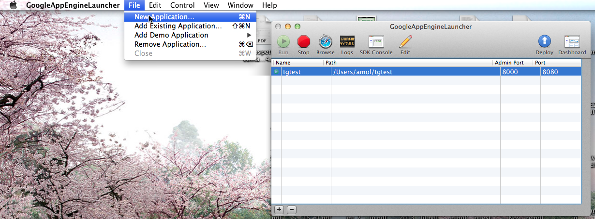
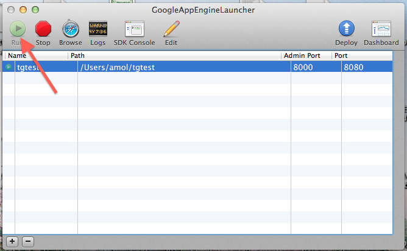
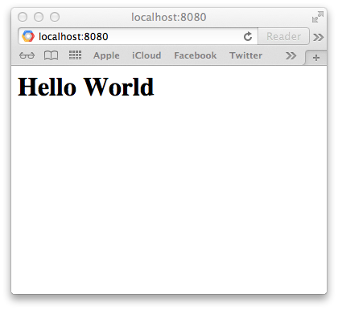
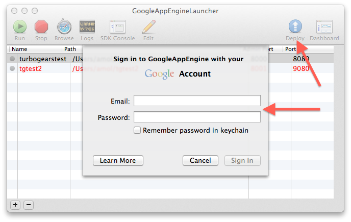
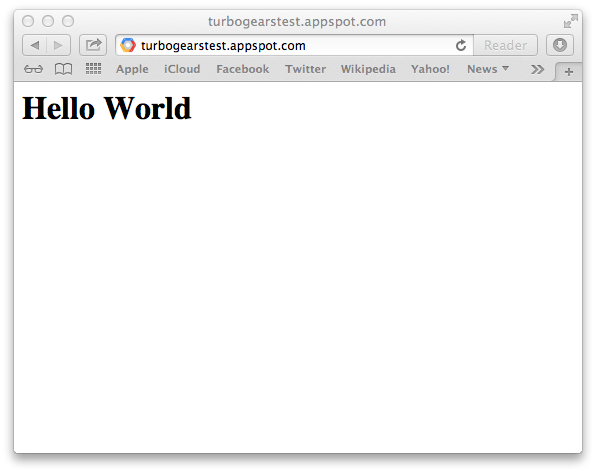

==========================================================
Running TurboGears under AppEngine
==========================================================

This recipe describes how to create a minimal mode TurboGears application
under Google AppEngine.

Step 0: Install AppEngine
===========================

Install the AppEngine SDK from https://developers.google.com/appengine/downloads#Google_App_Engine_SDK_for_Python
The following guide uses the AppEngine SDK for OSX.

Step 1: Create Application
===================================

First required step is to create an AppEngine application, this can easily
be done through the AppEngine SDK.

If you are not using the AppEngine SDK for OSX please refer to the
`AppEngine Documentation <https://developers.google.com/appengine/docs/python/>`_
to create a new application.

This will create a new application in the specified directory with
the following files:

.. code-block:: bash

    $ tree
    .
    ├── app.yaml
    ├── favicon.ico
    ├── index.yaml
    └── main.py

By default the created application relies on the Webapp2 framework,
to remove this dependency edit the ``app.yaml`` file and delete the
following part:

.. code-block:: text

    libraries:
    - name: webapp2
      version: "2.5.2"

Step 2: Setup Dependencies
====================================

On AppEngine, all the dependencies of you application should be provided with the
application itself. This makes so that we are required to install TurboGears inside
the application directory.

Supposing your application is named ``tgtest`` and you created it in your HOME,
to do so we first need to create a temporary virtual environment we will throw
away when everything is installed:

.. code-block:: bash

    $ cd ~/tgtest
    $ virtualenv --no-site-packages tmpenv
    New python executable in tmpenv/bin/python
    Installing setuptools............done.
    Installing pip...............done.

.. note:: Depending on your virtualenv command version, the ``--no-site-packages`` option
    might not be required.

Now will enable the virtualenv and install the ``TurboGears2`` dependency, only
difference is that instead of installing it inside the virtual environment itself
we will tell pip to install it inside the ``packages`` directory of our application:

.. code-block:: bash

    . tmpenv/bin/activate
    (tmpenv)$ pip install -t packages -I TurboGears2

As AppEngine doesn't provide ``setuptools`` the last required step is to also
provide ``setuptools`` inside our ``packages`` directory:

.. code-block:: bash

    (tmpenv)$ pip install -t packages -I setuptools

.. note:: Please note the -I option to force pip ignoring the currently installed packages.

Now all the required dependencies are installed inside the ``packages`` directory
and our virtual environment can be deleted:

.. code-block:: bash

    (tmpenv)$ deactivate
    $ rm -r tmpenv

Step 3: The TurboGears Application
====================================

Now we can proceed editing the ``main.py`` file which is started by
AppEngine to run our application and actually write a TurboGears application there.

The first required step is to tell python to load our dependencies from
the ``packages`` directory inside our application. So at the begin of
your ``main.py``, right after the leading comment, add the following lines:

.. code-block:: python

    import os
    import site
    site.addsitedir(os.path.join(os.path.dirname(__file__), 'packages'))

Then, inside the ``main.py`` file, after the ``site.addsitedir`` line,
you can create the actual WSGI application which must be named ``app``
for AppEngine to serve it:

.. code-block:: python

    from tg import expose, TGController, AppConfig

    class RootController(TGController):
         @expose()
         def index(self):
             return "<h1>Hello World</h1>"

    config = AppConfig(minimal=True, root_controller=RootController())
    app = config.make_wsgi_app()

Step 4: Start The Application
====================================

Now that the application is ready, we can start it from the *GoogleAppEngineLauncher*

and point our browser to ``http://localhost:8080`` to get its output

.. note:: if something went wrong, you can press the ``Logs`` button and check
    the application output.

Step 5: Deploy It!
===================================

Now that your application is correctly running locally, it's time to send
it to Google servers.

First required step, is to let google know that our application exists.
To do so, point your browser to ``https://appengine.google.com/`` and
press the ``Create Application`` button to create a new application.

Once you created your application and have a valid ``Application Identifier``
available, edit the ``app.yaml`` file inside ``tgtest`` to set the correct
identifier:

.. code-block:: text

    application: turbogearstest

.. note:: replace ``turbogearstest`` with your own app identifier.

Now get back to the *GoogleAppEngineLauncher* and press the **Deploy** button.
It will ask for your google account credentials, and will then proceeed with the
deploy.

As soon as it finished the deploy, your application will be available online
at the reserved URL. Which is in the form *APPID.appspot.com*, in our example
we can point the browser to ``http://turbogearstest.appspot.com`` and get
our application output.

