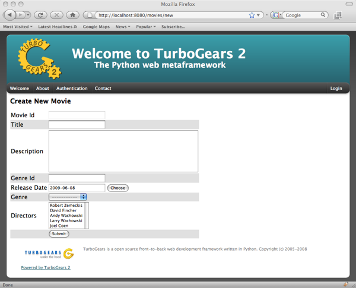
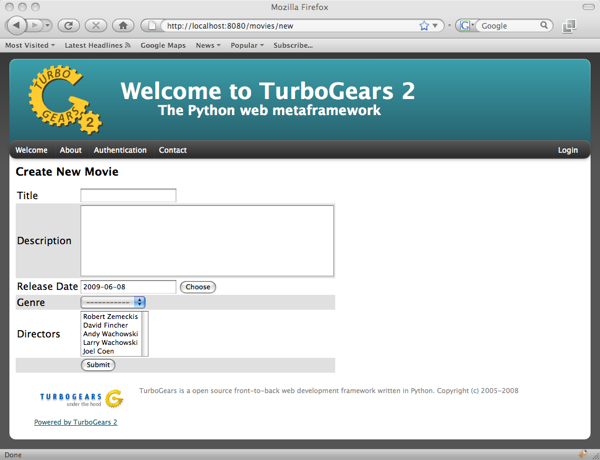
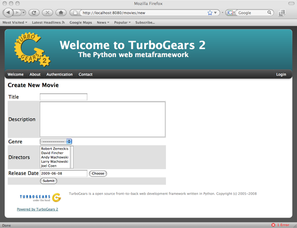
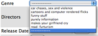
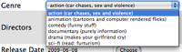
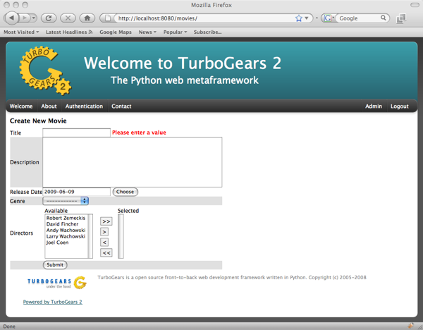

.. _sprox:

Autogenerated Forms with Sprox
=========================================

This is a succinct explanation on how to use sprox's form rendering
capabilities within TurboGears2. We will assume the reader is somewhat
versed in TurboGears2's :class:`tg.controllers.RestController`.  Note
that this is the same technology the Turbogears2 admin is based on, so
this knowledge is valuable to understand how to configure the admin
for your purposes.

Establishing the Model Definition
-----------------------------------

Let us first assume the following model for this demonstration.::

    from sqlalchemy import Column, Integer, String, Date, Text, ForeignKey, Table
    from sqlalchemy.orm import relation

    from moviedemo.model import DeclarativeBase, metadata

    movie_directors_table = Table('movie_directors', metadata,
                                  Column('movie_id', Integer, ForeignKey('movies.movie_id'), primary_key = True),
                                  Column('director_id', Integer, ForeignKey('directors.director_id'), primary_key = True))

    class Genre(DeclarativeBase):
        __tablename__ = "genres"
        genre_id = Column(Integer, primary_key=True)
        name = Column(String(100))
        description = Column(String(200))

    class Movie(DeclarativeBase):
        __tablename__ = "movies"
        movie_id = Column(Integer, primary_key=True)
        title = Column(String(100), nullable=False)
        description = Column(Text, nullable=True)
        genre_id = Column(Integer, ForeignKey('genres.genre_id'))
        genre = relation('Genre', backref='movies')
        release_date = Column(Date, nullable=True)

    class Director(DeclarativeBase):
        __tablename__ = "directors"
        movie_id = Column(Integer, primary_key=True)
        title = Column(String(100), nullable=False)
        movies = relation(Movie, secondary_join=movie_directors_table, backref="directors")

The Basic Sprox Form
-----------------------
Here is how we create a basic form for adding a new Movie to the database::

    class NewMovieForm(AddRecordForm):
        __model__ = Movie
    new_movie_form = NewMovieForm(DBSession)

And our controller code would look something like this::

    @expose('moviedemo.templates.sproxdemo.movies.new')
    def new(self, **kw):
        tmpl_context.widget = new_movie_form
        return dict(value=kw)

You may have noticed that we are passing keywords into the method.  This is so that the
values previously typed by the user can be displayed on failed validation.

And finally, our template code::

    <html py:extends="master.xhtml" py:strip="True">
    <body py:block="body" py:strip="True">
      
 &nbsp; 

      

        

          <h2 style="margin-top:1px;>Create New Movie</h2>
          ${tmpl_context.widget(value=value)}
        

      

    </body>
    </html>

Which produces a form like this:

Omitting Fields
----------------------
Now, we can use the __omit_fields__ modifier to remove the "movie_id" and "genre_id" fields,
as they will be of little use to our users.  Our form code now becomes::

    class NewMovieForm(AddRecordForm):
        __model__ = Movie
        __omit_fields__ = ['genre_id', 'movie_id']

The rendered form now looks like this:

Limiting fields
----------------------
If you have more omitted fields than required fields, you might want to use the __limit_fields__
operator to eliminate the fields you don't want.  The same above form will be rendered with the
following code::

    class NewMovieForm(AddRecordForm):
        __model__ = Movie[
        __limit_fields__ = ['title', 'description', 'release_date', 'genre', 'directors']

Field Ordering
---------------
If you want the fields displayed in a ordering different from that of the specified schema,
you may use field_ordering to do so.  Here is our form with the fields moved around a bit::

    class NewMovieForm(AddRecordForm):
        __model__ = Movie
        __omit_fields__ = ['movie_id', 'genre_id']
        __field_order__ = ['title', 'description', 'genre', 'directors']

Notice how the release_date field that was not specified was still appended to the end of the form.

Overriding Field Attributes
-----------------------------

Sometimes we will want to modify some of the HTML attributes associated with a field.  This is as easy
as passing a __field_attrs__ modifier to our form definition.  Here is how we could modify the description
to have only 2 rows::

    class NewMovieForm(AddRecordForm):
        __model__ = Movie
        __omit_fields__ = ['movie_id', 'genre_id']
        __field_attrs__ = {'description':{'rows':'2'}}

Here is the resultant form:

.. image:: images/form/attrs.png

Overriding a Form Field
-----------------------------

Sometimes you want to override a field all together.  Sprox allows you to do this by providing
an attribute to your form class declaratively.  Simply instantiate your field within the widget
and it will override the widget used for that field.  Let's change the movie title to a password
field just for fun.::

    from tw.forms.fields import PasswordField

    class NewMovieForm(AddRecordForm):
        __model__ = Movie
        __omit_fields__ = ['movie_id', 'genre_id']
        __field_attrs__ = {'description':{'rows':'2'}}
        title = PasswordField

.. image:: images/form/password.png

You can see now that the title is "starred" out.  Note that you may also send an "instance" of
a widget for a field, but you must pass in the fieldname to the widget.  This is a limitation
of ToscaWidgets. (You may not change the "id" of a widget after it has been created.)::

    title = PasswordField('title')

Field Widget Args
-------------------

Sometimes you want to provide sprox with a class for a field, and have sprox set the arguments
to a widget, but you either want to provide an additional argument, or override one of the arguments
that sprox chooses.  For this, pass a dictionary into the __field_widget_args__ parameter with the
key being the field you would like to pass the arg into, and the value a dictionary of args to set
for that field.  Here is an example of how to set the  rows and columns for the description field of a form.::

    class NewMovieForm(AddRecordForm):
        __model__ = Movie
        __field_widget_args__ = {'description':{'rows':30, 'cols':30}}

Custom Dropdown Field Names
------------------------------

Sometimes you want to display a field to the user for the dropdown that has not been selected by
sprox.  This is easy to override.  Simply pass the field names for the select boxes you want to
display into the __dropdown_field_names__ modifier.::

    class NewMovieForm(AddRecordForm):
        __model__ = Movie
        __omit_fields__ = ['movie_id', 'genre_id']
        __field_order__ = ['title', 'description', 'genre', 'directors']
        __dropdown_field_names__ = ['description', 'name']

If you want to be more specific about which fields should display which field, you can pass
a dictionary into the __dropdown_field_names__ modifier.::

    class NewMovieForm(AddRecordForm):
        __model__ = Movie
        __omit_fields__ = ['movie_id', 'genre_id']
        __field_order__ = ['title', 'description', 'genre', 'directors']
        __dropdown_field_names__ = {'genre':'description', 'directors':'name'}

Either will produce a new dropdown like this:

Creating Custom Dropdown Data
-------------------------------

Sometimes providing a fieldname alone is not enough of a customization to inform your users into what
they should be selecting.  For this example, we will provide both name and description for the Genre field.
This requires us to override the genre widget with one of our choosing.  We will extend the existing
sprox dropdown widget, modifying the update_params method to inject both name and description into
the dropdown.  This requires some knowledge of ToscaWidgets in general, but this recipe will work
for the majority of developers looking to modify their dropdowns in a custom manner.

First, we extend the Sprox SingleSelect Field as follows::

    from sprox.widgets import PropertySingleSelectField

    class GenreField(PropertySingleSelectField):
        def _my_update_params(self, d, nullable=False):
            genres = DBSession.query(Genre).all()
            options = [(genre.genre_id, '%s (%s)'%(genre.name, genre.description))
                                for genre in genres]
            d['options']= options
            return d

Then we include our new widget in the definition of the our movie form::

    class NewMovieForm(AddRecordForm):
        __model__ = Movie
        __omit_fields__ = ['movie_id', 'genre_id']
        __field_order__ = ['title', 'description', 'genre', 'directors']
        __dropdown_field_names__ = {'genre':'description', 'directors':'name'}
        genre = GenreField

Here is the resulting dropdown:

Adding a New Field
---------------------

There may come a time when you want to add a field to your view which is not part of your
database model.  The classic case for this is password validation, where you want to provide
a second entry field to ensure the user has provided a correct password, but you do not
want/need that data to be stored in the database.  Here is how we would go about
adding a second description field to our widget.::

    from tw.forms.fields import TextArea

    class NewMovieForm(AddRecordForm):
        __model__ = Movie
        __omit_fields__ = ['movie_id', 'genre_id']
        __field_order__ = ['title', 'description', 'description2', 'genre', 'directors']
        description2 = TextArea('description2')

For additional widgets, you must provide an instance of the widget since sprox will not
have enough information about the schema of the widget in order to populate it correctly.
Here's what our form now looks like:

.. image:: images/form/add_field.png

Validation
--------------
Turbogears2 has some great tools for validation that work well with sprox.  In order
to validate our form, we must first give the form a place to POST to, with a
new method in our controller that looks like::

    @validate(new_movie_form, error_handler=new)
    @expose()
    def post(self, **kw):
        del kw['sprox_id']
        kw['genre'] = DBSession.query(Genre).get(kw['genre'])
        kw['directors'] = [DBSession.query(Director).get(id) for id in kw['directors']]
        kw['release_date'] = datetime.strptime(kw['release_date'],"%Y-%m-%d")
        movie = Movie(**kw)
        DBSession.add(movie)
        flash('your movie was successfully added')
        redirect('/movies/')

A couple of things about this.  First, we must remove the sprox_id from the keywords
because they conflict with the Movie definition.  This variable may go away in future
versions. genre and directors both need to be converted into their related objects before
they are applied to the object, and the release_date needs to be formatted as a datetime object
if you are using sqlite.

Here is what the form looks like on a failed validation:

Overriding a Validator
-----------------------
Often times you will want to provide your own custom field validator. The best way to
do this is to add the validator declaratively to your Form Definition::

    from formencode.validators import String

    class NewMovieForm(AddRecordForm):
        __model__ = Movie
        __omit_fields__ = ['movie_id', 'genre_id']
        title = String(min=4)

The resulting validation message looks like this:

.. image:: images/form/validator.png

Overriding both Field and Validator
------------------------------------
Ah, you may have realized that sometimes you must override both widget and validator.  Sprox
handles this too, by providing a :class:sprox.formbase.Field class that you can use to wrap
your widget and validator together.::

    from formencode.validators import String
    from sprox.formbase import Field
    from tw.forms.fields import PasswordField

    class NewMovieForm(AddRecordForm):
        __model__ = Movie
        __omit_fields__ = ['movie_id', 'genre_id']
        title = Field(PasswordField, String(min=4))

Again, the field class does not care if you pass instances or class of the widget.

.. image:: images/form/field.png

Required Fields
--------------------
You can tell sprox to make a field required even if it is nullable in the database by passing
the fieldname into a list of the __require_fields__ modifier.::

    class NewMovieForm(AddRecordForm):
        __model__ = Movie
        __omit_fields__ = ['movie_id', 'genre_id']
        __require_fields__ = ['description']

And the form now sports a validation error:

.. image:: images/form/require.png

Form Validation
----------------

You can validate at the form level as well.  This is particularly interesting if you need to
compare two fields.  See :ref:`validation`.

Conclusion
--------------

:class:`sprox.formbase.FormBase` class provides a flexible mechanism for creating customized forms.
It provides sensible widgets and validators based on your schema, but can be overridden for your own
needs.  FormBase provides declarative addition of fields, ways to limit and omit fields to a set that
is appropriate for your application.  Sprox provides automated drop-down boxes, as well as providing
a way to override those widgets for your purposes.
