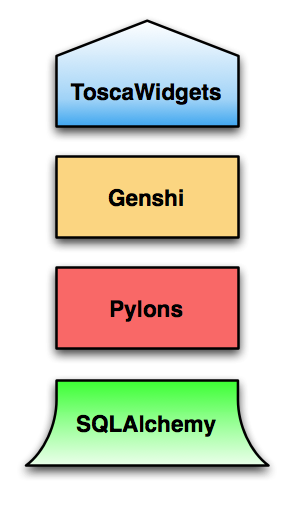

.. _mainindex:

TurboGears Documentation
========================

TurboGears is a web framework written in Python that combines best-of-breed
technologies to offer a developer rapid initial ramp-up, an even learning curve,
and scalability as your project grows.  TurboGears is built on a 
stack of technologies that allows us to focus on the parts that are important
only to TurboGears.  Although TurboGears provides fully featured ORM 
(Object Relational Mapper), Templating Languages, and URL dispatch mechanisms,
the codebase remains less than 2000 lines of executable code.

It is important to note that this version of TurboGears is a reinvention 
of the original TurboGears project developed by Kevin Dangoor.  TurboGears2
was developed to increase cooperation between the Python Web Framework 
community, especially with the Pylons project.  TurboGears also leverages
WSGI (Web Server Gateway Interface) components available today.  :term:`WSGI`
allows web applications to share a common api to provide a layered approach
to generating web content.

The TurboGears Stack: An Overview
------------------------------------

TG2 represents a change from some of the components in TurboGears 1.x, but
we've now invested in a set of components that we think will continue to be at
the center of python web development for years to come.  From the beginning 
TurboGears was designed to be a Full Stack framework built from best-of-breed
components.  TurboGears takes some of the guesswork out of choosing from the
various components available by providing you with a set of productive defaults,
while still providing the abilty to change those defaults if something better
meets the needs of your project.

The TurboGears stack is made up of a four main components that aim at increasing
web development productivity.  Each of these components can in fact be used
independently, or within other applications, so the knowledge you gain
by learning about this components is highly applicable to other projects
you might do, including those outside the scope of web design.  Here is a breakdown
of what you can expect to see in the stack.

ToscaWidgets_  is a full-featured widgetting library that makes it easier
to coordinate front end design with server development.  In the previous version
of TurboGears this role was delegated to a single JavaScript framework: MochiKit.
ToscaWidgets gives you the choice to incorporate your JS library of choice, either
for your entire site, or for individual pages.

Genshi_ was popularized by the project tracking software called Trac.  Genshi
provides an easy way to create templated content by providing developers
with pythonic tools, (x)html validation, and useful debugging messages.  Kid
Developers coming over from TurboGears 1.1 will feel at home with the familiar
syntax.

Pylons_ is our web server of choice.  Pylons is a good choice for our web server,
because it embraces WSGI, and is also broken into smaller swappable components.  Pylons
gives us routing, caching, sessions, and a set of thread-safe globals to make
development easier.

SQLAlchemy_ has been called the best Object Relational Mapper in _any_ language.
SQLAlchemy provides a solid foundation to build your data-driven application from.
SA allows you to abstract your database to Python objects, while still giving
you access to your database in tabular, and even SQL form.  Using SQLAlchemy also gives
you the ability to use a number of add-on tools like migrate_ and bootalchemy_.

.. _ToscaWidgets: http://toscawidgets.org
.. _Genshi: http://genshi.edgewall.com
.. _Pylons: http://pylonshq.com
.. _SQLAlchemy: http://sqlalchemy.org
.. _migrate: http://code.google.com/p/sqlalchemy-migrate/
.. _bootalchemy: http://pypi.python.org/pypi/bootalchemy/

:ref:`Getting Started <getting-started>`
----------------------------------------
    Get TurboGears installed and serving up the main page for your new
    project

:ref:`Tutorials <tutorials>`
----------------------------

    For the new TurboGears user, this is the place to start.  These tutorials 
    are intended to get you started working quickly and give you a feel for 
    how TurboGears applications work.

:ref:`Working with TurboGears <recipes-and-faq>`
------------------------------------------------
    How to accomplish given tasks using TurboGears, from authentication, to 
    caching, to user-session management.  This collection of documents should 
    normally be explored after you've followed through a tutorial or two.

:ref:`Getting To Know TurboGears <getting-to-know>`
---------------------------------------------------
    Learn what's new in the latest TurboGears. Explore the architecture. Learn
    what components come with the default install of TurboGears, what
    components are installed via the default quickstart, and how all of them
    tie together to serve your site.

:ref:`Extensions and Tools <extensions-and-tools>`
--------------------------------------------------
    Discover new extensions and tools to enhance your installation of
    TurboGears.

:ref:`Testimonials <testimonials>`
----------------------------------
    A selection of papers and comments showing how TurboGears helped other
    developers solve the problems they had.

Indices and tables
==================

* :ref:`genindex`
* :ref:`modindex`
* :ref:`search`
* :ref:`extendedtoc`

.. note:: These documents are a :ref:`work in progress <todolist>`, so please feel free to tackle some of the items and send in patches!

.. todo:: Difficulty: Medium. make docs more linky.   provide link to pylons, and why tg2 is now based on it.   eventually, I'd really like to see links to pylonsbook for specific "more information", and how turbogears is different/expands upon it

.. glossary::

   WSGI_ 
      Web Server Gateway Interface

.. _WSGI: http://www.wsgi.org/wsgi/

