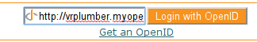

.. _openid:

Adding OpenID Support
=====================

`OpenID` is a mechanism whereby you may delegate authentication 
of the user's identity to third-parties.  This allows users to 
use a single-sign-on service, such as their web-mail provider to 
authenticate at your site.

The `OpenID` protocol allows you to request 
additional information about the user, such as their email,
display-name, preferred userid, etceteras.  It also allows the 
user to deny or customize that information as it is provided 
to you.

There is an `OpenID` plugin for repoze.who 
which is generally configured via a `who.ini` file.
As an example of what you can do with a custom configuration when 
:ref:`using who.ini<using-who.ini>`, let's add the ability to use 
OpenID to our configuration.

Installation
------------

We need to install the `repoze.who.plugins.openid` package:

.. code-block:: bash

    easy_install repoze.who.plugins.openid 

.. note::

    You will have to use at least version 0.5.3 or above of 
    `repoze.who.plugins.openid`, for this tutorial. Certain 
    features such as the callback to create new user records 
    on authentication are very new to the plugin.

Since we will be building on the custom `who.ini` mechanism, 
we need to be :ref:`using who.ini<using-who.ini>` before we 
start this process.  If you aren't currently using `who.ini`,
follow through that process first.

Auto-registration on OpenID Authentication
------------------------------------------

.. note::

    `OpenIDs` are cheap, do not use them for authorization by 
    themselves.  While legitimate users might be wary of tarnishing
    their main email address's "good name", an attacker can set up 
    a server that will authenticate them in a few minutes.  
    A user presenting an `OpenID` is not to be trusted based 
    solely based on that provision of information.

If you are starting from a Quick-started project, your 
applications will be based around a database-based model of 
Users, Groups and Permissions.  To minimize the impact on your 
application in supporting OpenID, you will normally want to 
enroll authenticated OpenID users as Users in your database.

The registration process must determine the level of authorization
to grant an `OpenID`-based enrollment.  Keeping in mind that 
`OpenIDs` are cheap, this should likely be about the same level 
of authorization as a user who has provided a (validated) email 
address.  In our example code we don't add the user to any 
permission-group.

Our registration will be done by our `Metadata Provider`.  
The `Metadata Provider` is responsible for providing information 
such as a user's display-name or gender about an account based 
on the identity of the account.  There is currently 
an SQLAlchemy Metadata provider which uses the User and Group 
accounts to provide Metadata, we set this up in our switch to 
using `who.ini` in our lib/auth.py module 
(we named it `md_group_plugin` there).

Here's our new metadata provider (in `lib/auth.py`):

.. code-block:: python

    class OpenIDMetadata( object ):
        key_map = {
            # maps identity : sreg keys
            'display_name': 'fullname',
            #'username': 'nickname',
            'email_address': 'email',
        }
        def __init__( self ):
            """Create the (simplistic) metadata provider"""
            self.mapping = {}
        def register_user( self, open_id, sreg_data ):
            """Add SReg extension data to our mapping information"""
            self.mapping[ open_id ] = sreg_data
            current = model.User.by_user_name( open_id )
            if current:
                # TODO: could update the in-db values...
                if current.password:
                    return False
                return True
            else:
                values = self.as_user_values( sreg_data, {} )
                model.DBSession.add(
                    model.User( 
                        user_name = open_id,
                        **values 
                    )
                )
                transaction.commit()
                return True 
        def as_user_values( self, values, identity ):
            """Given sreg values, convert to User properties"""
            for id_key,sreg_key in self.key_map.items():
                value = values.get( sreg_key )
                if value is not None:
                    identity[id_key] = value 
            return identity
        def add_metadata( self, environ, identity ):
            """Add our stored metadata to given identity if available"""
            key = identity.get('repoze.who.plugins.openid.userid')
            if key:
                values = self.mapping.get( key )
                if values:
                    identity = self.as_user_values( values, identity )
            return identity

.. note::

    The only reason to have the registration part of the metadata provider 
    is that `repoze.who` doesn't have a `registration` plugin-type.
    Future versions of the plugin might make the registration function
    separate from the metadata provision by explicitly referencing the 
    registration operation from the `OpenID` plugin.

Enabling OpenID
---------------

We need to alter our `who.ini` to make use of the various `OpenID` 
components.  We configure:

 * an identification plugin (which is what actually identifies the user 
   based on their ability to log into the specified server).  It 
   intercepts requests based on the configured URLs, as it is application 
   middleware, not controller-based.  It stores the identity using the 
   auth_tkt mechanism, as does our regular FriendlyForm identifier
 * our `OpenIDMetadata` plugin above 
 * a challenge decider plugin (which determines whether to invoke the 
   login machinery for a given request)

and then we wire each of those plugins into the main `repoze.who` 
machinery.

.. code-block:: ini

    [plugin:openid]
    use = repoze.who.plugins.openid:make_identification_plugin

    store = file
    store_file_path = %(here)s/sstore
    openid_field = openid
    came_from_field = came_from
    error_field = error
    session_name = beaker.session
    login_form_url = /login
    login_handler_path = /openid_login_handler
    logout_handler_path = /logout_handler
    logged_in_url = /
    logged_out_url = /
    rememberer_name = auth_tkt

    [plugin:openidmd]
    use = customwho.lib.auth:OpenIDMetadata

    [plugin:auth_tkt]
    use = repoze.who.plugins.auth_tkt:make_plugin
    secret = 'this secret is not really very SECRET!'

    [plugin:friendlyform]
    use = repoze.who.plugins.friendlyform:FriendlyFormPlugin
    login_form_url= /login
    login_handler_path = /login_handler
    logout_handler_path = /logout_handler
    rememberer_name = auth_tkt
    post_login_url = 
    post_logout_url = 

    [plugin:sqlauth]
    use = customwho.lib.auth:auth_plugin

    # Now the configuration starts wiring together the pieces
    [general]
    request_classifier = repoze.who.classifiers:default_request_classifier
    challenge_decider = repoze.who.plugins.openid.classifiers:openid_challenge_decider

    [identifiers]
    # We can decide who the user is trying to identify as using either 
    # a fresh form-post, the session identifier cookie, or a fresh OpenID 
    # authentication
    plugins =
        friendlyform;browser
        openid
        auth_tkt

    [authenticators]
    # openid and password authentication available
    plugins =
        openid
        sqlauth

    [challengers]
    plugins =
        openid
        friendlyform;browser

    [mdproviders]
    # We add our custom metadata provider to the set of 
    # possible metadata providers.
    plugins =
        openidmd
        customwho.lib.auth:md_plugin
        customwho.lib.auth:md_group_plugin

Adding the User Interface
-------------------------

    
We provide an OpenID form on our login page to allow the user 
to enter their OpenID and log in.  We're using the main "login"
template, as it allows us to provide an "alternate" interface
where the user of OpenID can login just as readily as any other 
user.  You may prefer to use a separate page for OpenID sign-in,
particularly if you wish to provide more instructions or 
specialized sign-in buttons for certain identity providers:

.. code-block:: html

    <form action="${tg.url('/openid_login_handler', came_from = came_from.encode('utf-8'), __logins = login_counter.encode('utf-8'))}" method="POST" class="openid-login">
        <input type="text" id="openid" name="openid" class="text" value="http://"></input>
        <input type="submit" id="submit" value="Login with OpenID" />
            <input type="hidden" value="/" name="returnto"/>
            <input type="hidden" value="claim_openid" name="op"/>
            <input type="hidden" value="1" name="openid_login"/>    
            

                <a href="http://openid.net/get-an-openid/">Get an OpenID</a>
            

    </form>

At this point, we can point our browser at our site's `/login` page and 
see a crude form which allows us to type in an `OpenID` and authenticate
with an `OpenID` URL.

.. note::

    Most of the major `OpenID` providers have specified that their 
    users should *not* be given raw `OpenID` logins such as seen above.
    Instead they want to have "Log in with Yahoo" or "Log in with Google"
    buttons, which under the covers invoke OpenID, but do not require 
    the user to construct or remember `OpenID` URLs themselves.
    
    Those who have implemented `OpenID` have fairly consistently reported 
    that user confusion is one of the biggest problems for the system,
    so if you are going to implement `OpenID` on your site, plan to spend 
    some time making your interface simple and obvious.  You may find that 
    you need to implement the sign-on as a full page with background 
    discussions and examples to avoid user confusion.

.. todo:: Provide sample code for the "Log in with ..." implementations.

Adding Some Style
-----------------

OpenID provides a logo suitable for use as a background for text-boxes.
We can download this logo to our project's `public/images` directory:

.. code-block:: bash

    wget http://wiki.openid.net/f/openid-16x16.gif

And then reference it from our css stylesheet `public/css/style.css` 
to get a reasonable looking and somewhat compact login form:

.. code-block:: css

    form.openid-login {
        border: thin solid #f7931e;
        padding: .25em;
    }
    form.openid-login input[type="text"] {
        padding-left: 16px;
        background: url('/images/openid-16x16.gif') top left no-repeat;
        width: 10em;
    }
    form.openid-login input[type="submit"] {
        background-color: #f7931e;
        color: white;
    }

.. todo:: Difficulty Medium/Hard: document how to provide group/permission
          support when using an OpenID Authentication provider.
.. todo:: Difficulty Hard: document how to store OpenID identifiers in 
          SQLAlchemy (i.e. add records for each new OpenID identity)

References
----------

 * :ref:`using-who.ini` -- describes the process to switching to `who.ini` 
   from quickstart
 * `Get an OpenID`_ -- describes how to get an OpenID URI via various services,
   you may already have an OpenID provider.  If not `myopenid.com` can be used 
   to set up a new ID
 * `Repoze.who.plugins.openid`_ -- documentation for the plugin

.. _`Repoze.who.plugins.openid` : http://quantumcore.org/docs/repoze.who.plugins.openid/
.. _`Get an OpenID` : http://openid.net/get-an-openid/
