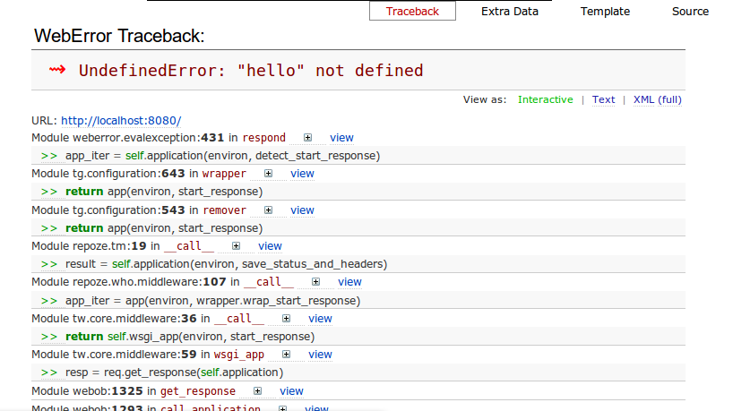
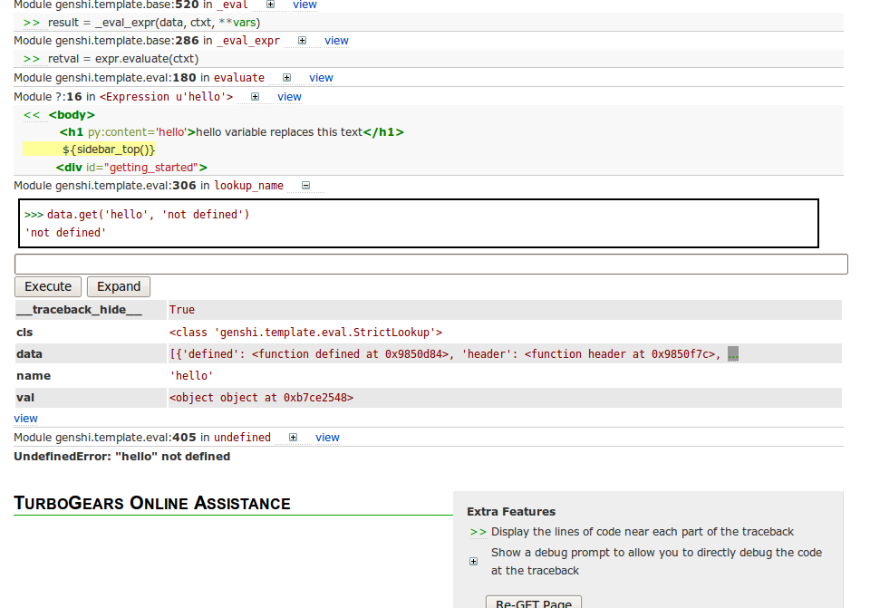
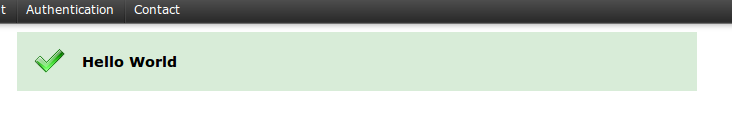

TurboGears 2 at a glance
========================

:Status: Work in progress

Introducing MVC (Model View Controller)
---------------------------------------

This tutorial is an extension of the tutorial :ref:`quickstarting`.  In order
to follow along properly, you should have already completed that tutorial, and
be serving your project with::

   paster serve --reload development.ini

TurboGears 2, like TurboGears 1 and many other modern web frameworks, uses a
pattern called "Model View Controller", or "MVC" pattern.  Basically the MVC
pattern is an attempt to separate the code which handles what the user sees
(the view) from the code that responds to user actions (the controller) and
code that changes the state of data (the model). 

The goal of the MVC pattern is to help you create more flexible software, and
since web-applications tend to have more user-interface changes than anything
else, it's particularly designed so that you can change the `view` code without
necessarily having to change anything else. 

Here we'll explore some of the different approaches to displaying the 
obligatory "Hello World" text.   In doing so, we'll introduce you to the 
V and C of MVC, the view and controller.

Hello World Using Template
--------------------------

In this first approach, we'll use the existing template that was provided
by the quickstart application, and add a "Hello World" headline.

To keep the tutorial small and simple, we make an assumption that you already
have some knowledge about html tags.

Edit helloworld/templates/index.html, and add a <h1> tag like this:

.. code-block:: html

  ...
  <body>
  <h1>Hello World</h1>
  ...
  </body>

The <h1> tag should be added just after the <body> tag of the template, so
that the template is still a valid HTML file.   

You can now point your browser at http://localhost:8080 to see the change. You
should see "Hello, world!" text in h1 size.

Hello World Using Static File
--------------------------------

Open a new file, edit the content as a simple html file:

.. code-block:: html

    <html>
    <body>
    <h1>Hello World</h1>
    </body>
    </html>

and save it to helloworld/public/hello.html.

Browse http://localhost:8080/hello.html and see the page.

Hello World Using Controller
-------------------------------

The controller defines how the server responds to user actions.   In the case
of a web framework this almost always means HTTP requests of some kind (either
directly initiated, or fired off by JavaScript as part of an Ajax app).   

TurboGears 2 uses an `Object Publishing` system to determine what controller
method will be called for a particular URL.  Basically you have RootController,
with @exposed objects which define your URL hierarchy. This means that the
index method of your RootController is called when you go to /index (or even
just /).  We can tell our controller to respond at a new URL by defining a new
method. 

In this case we will add a new method called hello, which just returns a
string.   TG2 allows us to bypass the template process and return a string
directly to the http response, which will be returned to the browser directly.  

Edit helloworld/controllers/root.py:

.. code-block:: python

  # skipped various imports here, these two are used in example below
  #    (.. note:: these should already be included by quickstart code)
  from helloworld.lib.base import BaseController
  from tg import expose

  class RootController(BaseController):

      ### skipped index method are here! 
      #  (there are also a few other items above it)

      @expose()
      def hello(self):
          return "Hello World from the controller"

Browse http://localhost:8080/hello to see the change.

Hello World Combining Template With Controller
-----------------------------------------------

So far, we've been returning plain text for every incoming request.  
But you might have noticed that the index method does a little more.
This time we'll use a template, and pass it a variable using a dictionary.

To save a little time, we are re-using the existing index.html template.   

.. code-block:: python

  #### skipped other imports
  from helloworld.lib.base import BaseController
  from tg import expose

  class RootController(BaseController):

      ### skipped index and hello methods are here!

      @expose('helloworld.templates.index')
      def new_hello(self):
          return dict(hello="Hello World via template replacement")

TurboGears sees that the controller returned a dict, and that there's a
template name defined in the @expose decorator.  TurboGears renders that
template, turning the elements of the dictionary into local variables in the
template's namespace.  That means that we've now got a 'hello' variable in our
template which we can use when we call the new_hello method. 

The ``@expose`` decorator's first argument is the template name given in
"dotted" notation just like a python module.   TurboGears 2 uses the Genshi_
templating system by default, which uses the filename extension of `.html`.
So, in this case, 'helloworld.templates.index', translates to the file
`helloworld/templates/index.html`.

So let's edit helloworld/templates/index.html to replace the h1 tag we added
earlier with:

.. code-block:: html

  <h1 py:content="hello">hello variable replaces this text</h1>

Browse http://localhost:8080/new_hello to see the change.

The `py:content` attribute we added to the `<h1>` tag above is an example of a
`Genshi template directive
<http://genshi.edgewall.org/wiki/Documentation/0.5.x/xml-templates.html#id7>`_.
It directs genshi to replace the content of the h1 tag with the value of the
`hello` variable.

For each page on your site, you could have a controller method with a
corresponding template file specified using the ``@expose`` decorator.  

To create more skeletons for your templates, just copy the default index.html
template that was generated when your project was created.

A Controller can return a dictionary to pass variables and other dynamic
content to the template.

Not every template has dynamic content and therefore may not need arguments. In
that case, just return an empty dictionary:

.. code-block:: python

  @expose(template="helloworld.templates.index")
  def index(self):
      return dict()

Oops, we made a mistake!  We're trying to use variables in index.html
which we're not creating in our controller. But, let's take advantage of 
this mistake to take a quick look at the interactive debugger page that 
TG2 gives you when you get a python exception in your code. 

Browse http://localhost:8080/ to see the error.   Here is a screenshot.

  
This gives you an opportunity to explore the full stack trace interactively.
If you click on the little + icon, you can see what local variables are set at
that frame in the call stack, and you can even use the text entry provided
there to type in some python code to test what's happening at that level. 

There is also a `>>` link near each line of source code, which allows you 
expand that source code, and see a few surrounding lines.  The `view` link 
lets you view the whole source code file.

Here is a screenshot after scrolling near the bottom of the debugger window,
clicking the `>>` link near <Expresion u'hello'>, and the + icon after
`lookup_name`.   To really confirm what was happening, we also entered a python
command to look at the contents of the "data" variable (this is where
lookup_name checks for template variables to display).

In this case, we can see that we are trying to use the "hello" variable
which is not defined.   To fix the problem, we need to pass "hello" to 
our index method as well.

.. code-block:: python

  @expose(template="helloworld.templates.index")
  def index(self):
      return dict(hello='Hello variable from index')

The interactive debugger is actually something that TurboGears 2 got "for free"
since it is now based on the Pylons_ framework.   You can read more about the
`interactive debugger here
<http://pylonsbook.com/en/1.0/tracking-down-problems-and-handling-errors.html>`_.

Hello World Using Flash
--------------------------------

Here we are going to use a builtin function that TurboGears supplies 
you with called "flash".   This function works in conjunction with the 
default templates that quickstart provided you with to show a highlighted
message to the end user.   The "flash" function has no relation to 
adobe/macromedia flash player.

To use it, we will modify our index method one more time.   
Edit helloworld/controllers/root.py, and add a 'flash' statement::

  flash("Hello World")

Below is the complete index method, including our fix for the "oops" above.

.. code-block:: python

  #### skipped other imports
  from helloworld.lib.base import BaseController
  from tg import expose, flash

  class RootController(BaseController):

      ### skipped index and hello methods are here!

      @expose('helloworld.templates.index')
      def index(self):
          flash("Hello World")
          return dict(hello="Hello World via template replacement")

Browse http://localhost:8080 to see the change.

Below is a brief screenshot of what our flash message looks like:

How did the flash message get included in the template?   The index.html
template is actually an extension of the "master.html" template, which 
includes a call to display the highlighted (flash) message.   The
master.html template is referenced in index.html with this line, near
the top of the file::

    <xi:include href="master.html" />

.. todo:: Ideally, this would be a great spot to link to further information
    about genshi and more about what is included in the "default" master
    template...

What was covered
----------------

Here we showed various ways of displaying messages to the user with 
TurboGears, and gave a brief introduction to using templates.  We also 
learned a little about Controllers, and got introduced to the MVC concept
(Model View Controller).    We just scratched the surface on the V and C
parts here.

.. todo:: This would be a good spot to link to further information about templates
    and controllers...

and of course, the next step in the tutorial path!

.. _Genshi: http://genshi.edgewall.org
.. _Pylons: http://www.pylons.org

.. todo:: Review this file for todo items.
.. todo:: laurin added a bunch of text and images.   further review for 
   typos, etc.
.. todo:: I'm not sure where we have additional information yet, but 
   it should be linked here, when it is identified.

