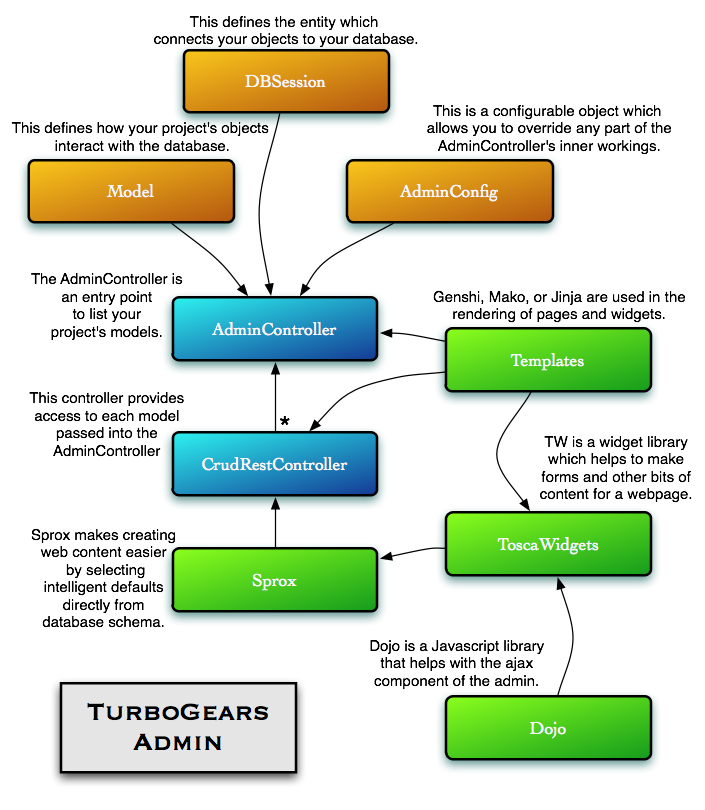
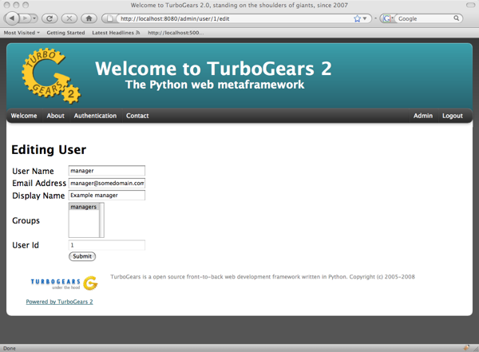
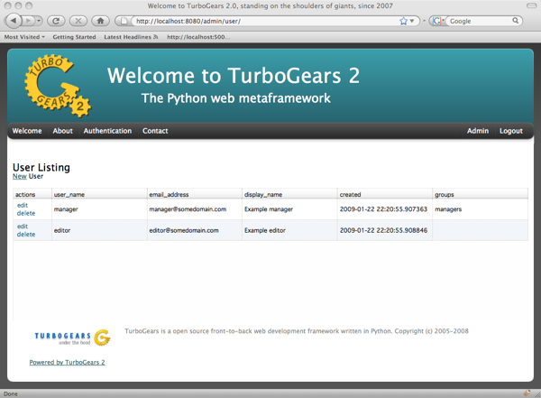

.. tgext.admin documentation master file, created by sphinx-quickstart on Mon Jan 19 21:36:58 2009.
   You can adapt this file completely to your liking, but it should at least
   contain the root `toctree` directive.

.. _tgext-admin:

TurboGears Administration System
=======================================

Overview
-----------------
The TurboGears Admin is a powerful system to create automated CRUD for your application.  
It provides a fully configurable interface and AJAX capabilities.  The default admin
is configured to work with the paster quickstart template, but can be easily modified to fit
your application's needs.  Forms are automatically validated, and the URL structure 
for all requests is based on HTTP verbs, also known as RESTful URLs. Here is a basic overview
of how the components that make up the TurboGears Admin interact with your application.

Adding AdminController to your TG application
-------------------------------------------------

AdminController is like any other TGController, it can be added directly to any part of your
system simply by making it part of an existing Controller Class.  Here is how you would add it to
the root controller::

    from tgext.admin import AdminController
    from myproject import model
    from myproject.model import DBSession
    
    class RootController(BaseController):
        admin = AdminController(model, DBSession)

To provide an even nicer (AJAX based) interface for tgext.admin, make sure to

.. code-block:: bash

    easy_install tw.dojo

Using Multiple Databases
~~~~~~~~~~~~~~~~~~~~~~~~~~~~~~~~~~~~~~~~~~~~~~~
AdminController gets tied to a particular database session and set of models.  For this reason,
you need to create a new AdminController for each database you wish to express.  Therefore, once
you have your database connections set up in your project's model code, you might have a controller
that looks something like this::

    from tgext.admin import AdminController
    from myproject.model import model1
    from myproject.model import model2
    
    from myproject.model import DB1Session, DB2Session
    
    class RootController(BaseController):
        db1admin = AdminController(db1model, DB1Session)
        db2admin = AdminController(db2model, DB2Session)

Limiting the Models Shown in your Admin
~~~~~~~~~~~~~~~~~~~~~~~~~~~~~~~~~~~~~~~~~~~~~~~

The first element of AdminController can either take a module that contains mapped model classes, or a list of model classes that
are mapped.  For instance, if you wanted to limit the AdminController to just User and Group classes, you would 
have code as follows::

    from tgext.admin import AdminController
    from myproject.model import User, Group, DBSession
    
    class RootController(BaseController):
        admin = AdminController([User, Group], DBSession)

Securing your Admin
~~~~~~~~~~~~~~~~~~~~~~~~~~~~~~~~~~~~~~~~~~~~~~~
By default, AdminController is secured by limiting access only to users in the "managers" group.
You can subclass AdminController and provide whatever predicate you desire.  For example, you could change
the permissions to allow anyone with the 'manage' permission access with the following code::

    from repoze.what.predicates import has_permission
    from tgext.admin import AdminController

    class MyAdminController(AdminController):
        allow_only = has_permission('manage')

Please note that if you use a different config you will have to secure it.

For more information, please see :mod:`repoze.what`

Utilizing Translations from repoze.what
~~~~~~~~~~~~~~~~~~~~~~~~~~~~~~~~~~~~~~~~~

If you have an existing database format that you are retrofitting to TurboGears,
you can utilize your existing translation for identity with some additions for use in
the default AdminController.

Probably if you are here, you have already modified your app_cfg.py file to take into
account the translations from the standard TG names to those of your system.  This might
look something like this::

 base_config.sa_auth.translations = {"user_id":"userID",
                                     "user_name": "userName",
                                     "group_id":"groupID",
                                     }

You may also need to override other fields like permission_id and permission_name that
are not the same in the tg schema.  These are also ok to add to the sa_auth.translation
configuration option in the base_config.  You can now pass these translations into the
AdminController and have it render its forms as they pertain to your database schema::

    from tgext.admin import AdminController
    from myproject import model
    from myproject.model import DBSession
    from tg import config
    
    class RootController(BaseController):
        admin = AdminController(model, DBSession, translations=config.sa_auth.translations)

Using AdminConfig
---------------------

The TurboGears Admin comes configured out-of-the-box for use with the default quickstarted
template model, but your application may have different needs.  TurboGears Admin is designed
to meet those needs head on, allowing you to leave most boiler-plate behind, while overriding
the components of your application that are unique to your needs.

Starting with a Blank Slate
~~~~~~~~~~~~~~~~~~~~~~~~~~~~~
The TGAdminConfig which is the default actually does quite a bit of overriding for you, so that
your forms and tables will look nice the first time you use it.  We can set the AdminController
back to what Sprox uses for defaults, selecting form field information directly from the
database metadata.  This is roughly equivalent to the view Catwalk provides, minus the 
menu on the side::

    from tgext.admin import AdminController, AdminConfig

    class MyAdminConfig(AdminConfig):
    
    class RootController(BaseController):
        admin = AdminController(model, DBSession, config_type=AdminConfig)

Notice that we send the AdminConfig class un-instantiated.  By creating the Config instance at execution time, 
the transaction manager can handle the sessions properly, 
and the creation of forms can happen dynamically as the Classes in your Model are accessed.  This translates to speed
and robustness.

.. image:: images/index_ss.png

Overriding the Index Template
~~~~~~~~~~~~~~~~~~~~~~~~~~~~~~~~

Chances are, if your model is complex, an alphabetical list of Classes on the index page is not going 
to suit your needs. Luckily, the default template can be replaced with one of your own making
without too much trouble.
Simply subclass AdminController, providing your own default template.  It is a good idea to provide
the engine name explicitly in your template definition::

    from tgext.admin import AdminController, AdminConfig
    
    class MyAdminConfig(AdminConfig):
        default_index_template = "genshi:myproject.myadmintemplate"
    
    class RootController(BaseController):
        admin = AdminController(model, DBSession, config_type=MyAdminConfig)

Modifying CRUD Controller Types
~~~~~~~~~~~~~~~~~~~~~~~~~~~~~~~~~~~~~~

In a similar manner that Sprox treats Model Fields, AdminConfig treats a grouping of Models.
Each model has associated with it a CrudRestController.  This is a controller that performs
all of the CRUD operations using RESTful URLs.  The attributes of AdminController which are
not "index" define the models controller type within the context of AdminController.  AdminController
performs a lookup to its AdminConfig to see what type of CrudRestController it should use
when a request has come in which matches one of its models.  The url dispatch is set to
the model name in all lower case lettering.  If no specific controller type is found for a 
particular model, then the default controller is used.

Overriding a Form
~~~~~~~~~~~~~~~~~~

The classic example shows how to override the "new_form" of the User controller to match a common registration form,
complete with password verification:

.. code-block:: python

    from tgext.admin.config import AdminConfig, CrudRestControllerConfig
    from sprox.formbase import AddRecordForm
    from formencode import Schema
    from formencode.validators import FieldsMatch
    from tw.forms import PasswordField, TextField
    
    form_validator =  Schema(chained_validators=(FieldsMatch('password',
                                                             'verify_password',
                                                             messages={'invalidNoMatch':
                                                             'Passwords do not match'}),))
    class RegistrationForm(AddRecordForm):
        __model__ = User
        __require_fields__     = ['password', 'user_name', 'email_address']
        __omit_fields__        = ['_password', 'groups', 'created', 'user_id', 'town_id']
        __field_order__        = ['user_name', 'email_address', 'display_name', 'password', 'verify_password']
        __base_validator__     = form_validator
        email_address          = TextField
        display_name           = TextField
        verify_password        = PasswordField('verify_password')
    

    class UserCrudConfig(CrudRestControllerConfig):
        new_form_type = RegistrationForm
    
    class MyAdminConfig(AdminConfig):
        user = UserCrudConfig
        
    class RootController(BaseController):
        admin = AdminController(model, DBSession, config_type=MyAdminConfig)

Again, notice we override the "user" attribute of AdminConfig, which AdminController introspects to determine
how to create a controller for the User object.

Overriding a Table
~~~~~~~~~~~~~~~~~~~~~

Often times you will want to hide some columns which are not very useful to the user, such as id keys that point
to relations within the object.  The TGAdmin allows you to override these parts of the system using the Sprox Base
classes. Here is an example of how to create an AdminConfig which limits the User table to display_name and email_address::

    from tgext.admin.config import AdminConfig, CrudRestControllerConfig
    from sprox.tablebase import TableBase
    from sprox.fillerbase import TableFiller

    class MyAdminConfig(AdminConfig):
        class user(CrudRestControllerConfig):
            class table_type(TableBase):
                    __entity__ = User
                    __limit_fields__ = ['display_name', 'email_address']
                    __url__ = '../user.json' #this just tidies up the URL a bit
                    
            class table_filler_type(TableFiller):
                    __entity__ = User
                    __limit_fields__ = ['user_id', 'display_name', 'email_address']
        
    class RootController(BaseController):
        admin = AdminController(model, DBSession, config_type=MyAdminConfig)

You may have noticed that the table_filler_type's limit_fields includes 'user_id'.  This is because the
CrudRestController needs to have access to the primary keys in the model in order to perform it's dispatch.

Um, where'd my Dojo go?
~~~~~~~~~~~~~~~~~~~~~~~~~
Now the tables aren't being rendered by Dojo, so let's add that back.
Simply replace your Sprox imports with::

    from sprox.dojo.tablebase import DojoTableBase as TableBase
    from sprox.dojo.fillerbase import DojoTableFiller as TableFiller

Overriding All Form types for the CRUD Controllers
~~~~~~~~~~~~~~~~~~~~~~~~~~~~~~~~~~~~~~~~~~~~~~~~~~~~~~~~

Perhaps you have a CrudRestControllerConfig of your own design.  You can make it the default for all of the
CrudController creation in your config. ::

    class MyCrudRestControllerConfig(CrudRestControllerConfig):
        ...
        
    class MyAdminConfig(AdminConfig):
        DefaultControllerConfig = MyCrudRestControllerConfig
    

Wait a minute, is this is _just_ an Admin tool?
~~~~~~~~~~~~~~~~~~~~~~~~~~~~~~~~~~~~~~~~~~~~~~~

You may have keyed in on something.  TurboGears Admin can be utilized to support more than just Administrative tasks.
Since it is secured the same way the other TurboGears controllers on, you could use it for any user on your system.
The myriad of ways you can override different parts of the system mean that this tool could be an excellent resource
for rapid prototyping of a web application, or even as a provider of placeholder for future components.
