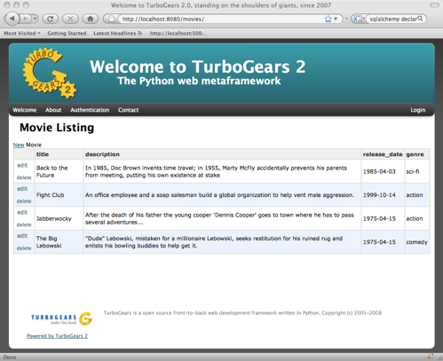
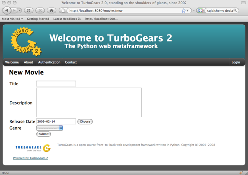
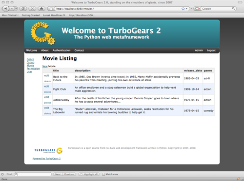
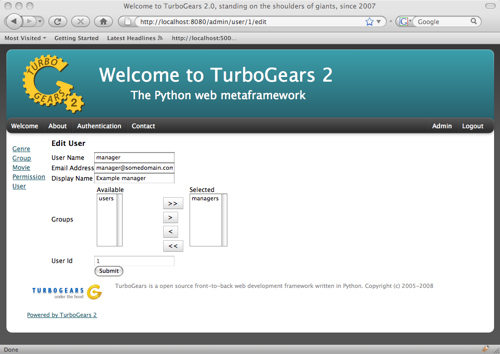

.. _tgext.crud.controller:

:obj:`tgext.crud.controller`
============================

Overview
--------

This is a simple extension that provides a basic controller class that
can be extended to meet the needs of the developer.  The intention is
to provide a fast path to data management by allowing the user to
define forms and override the data interaction with custom
manipulations once the view logic is in place.  The name of this
extensible class is CrudRestController.

What is CRUD?
~~~~~~~~~~~~~

CRUD is a set of functions to manipulate the data in a database:
create, read, update, delete.

Um, REST?
~~~~~~~~~

REST is a methodology for mapping resource manipulation to meaningful
URL.  For instance if we wanted to edit a user with the ID 3, the URL
might look like: /users/3/edit.  For a brief discussion on REST, take
a look at `the microformats entry
<http://microformats.org/wiki/rest/urls>`_.

Before We Get Started
---------------------

Here is the model definition we will be using for this tutorial::

    from sqlalchemy import Column, Integer, String, Date, Text, ForeignKey
    from sqlalchemy.orm import relation
    
    from moviedemo.model import DeclarativeBase
    
    class Genre(DeclarativeBase):
        __tablename__ = "genres"
        genre_id = Column(Integer, primary_key=True)
        name = Column(String(100))
    
    class Movie(DeclarativeBase):
        __tablename__ = "movies"
        movie_id = Column(Integer, primary_key=True)
        title = Column(String(100), nullable=False)
        description = Column(Text, nullable=True)
        genre_id = Column(Integer, ForeignKey('genres.genre_id'))
        genre = relation('Genre', backref='movies')
        release_date = Column(Date, nullable=True)

Putting The CRUD Into REST
--------------------------

Baby Steps
~~~~~~~~~~

The first thing we want to do is instantiate a CrudRestController.  We
import the controller from the extension, and then provide it with a
model class that it will use for its data manipulation.  For this
example we will utilize the Movie class.::

    from tgext.crud import CrudRestController
    from moviedemo.model import DBSession, Movie

    class MovieController(CrudRestController):
        model = Movie
    
    class RootController(BaseController):
        movies = MovieController(DBSession)

Well that won't actually get you anywhere, in fact, it will do nothing
at all.  We need to provide CrudRestController with a set of widgets
and datafillers so that it knows how to handle your REST requests.
First, lets get all of the Movies to display in a table.

Sprox
~~~~~

`Sprox <http://sprox.org>`_ is a library that can help you to generate
forms and filler data.  It utilizes metadata extracted from the
database definitions to provide things like form fields, drop downs,
and column header data for view widgets.  Sprox is also customizable,
so we can go in and modify the way we want our data displayed once we
get going with it.  Here we define a table widget using Sprox's
:class:`sprox.tablebase.TableBase` class for our movie table.::

    from sprox.tablebase import TableBase
    
    class MovieTable(TableBase):
        __model__ = Movie
        __omit_fields__ = ['genre_id']
    movie_table = MovieTable(DBSession)

Filling Our Table With Data
~~~~~~~~~~~~~~~~~~~~~~~~~~~

So, now we have our movie_table, but it's not going to do us much good
without data to fill it.  Sprox provides a
:class:`sprox.fillerbase.TableFiller` class which will retrieve the
relevant data from the database and package it in a dictionary for
consumption.  This is useful if you are creating JSON_.  Basically,
you can provide CrudRestController with any object that has a
get_value function and it will work because of duck typing.  Just make
certain that your get_value function returns the right data type for
the widget you are filling.  Here is what the filler would look like
instantiated.::

    from sprox.fillerbase import TableFiller

    class MovieTableFiller(TableFiller):
        __model__ = Movie
    movie_table_filler = MovieTableFiller(DBSession)

We add movie_id to the limited fields so that the "__actions__" field
can provide proper links to this primary key.

Putting It All Together
~~~~~~~~~~~~~~~~~~~~~~~

Let's modify our CrudRestController to utilize our new table.  The new
RootController would look like this::

    from tgext.crud import CrudRestController
    from moviedemo.model import DBSession, Movie
    from sprox.tablebase import TableBase
    from sprox.fillerbase import TableFiller
    
    class MovieTable(TableBase):
        __model__ = Movie
    movie_table = MovieTable(DBSession)

    class MovieTableFiller(TableFiller):
        __model__ = Movie
    movie_table_filler = MovieTableFiller(DBSession)
    
    class MovieController(CrudRestController):
        model = Movie
        table = movie_table
        table_filler = movie_table_filler
    
    class RootController(BaseController):
        movie = MovieController(DBSession)

You can now visit /movies/ and it will display a list of movies.

Forms
-----

One of the nice thing about Sprox table definitions is that they
provide you with a set of RESTful links.  CrudRestController provides
methods for these pages, but you must provide the widgets for the
forms.  Specifically, we are talking about the edit and new forms.
Here is one way you might create a form to add a new record to the
database using :class:`sprox.formbase.AddRecordForm`::

    class MovieAddForm(AddRecordForm):
        __model__ = Movie
        __omit_fields__ = ['genre_id', 'movie_id']
    movie_add_form = MovieAddForm(DBSession)

ToscaWidgets
~~~~~~~~~~~~

You might be wondering about what is behind-the-scenes of Sprox that
allows it to generate widgets.  The package responsible for building
the widgets is called `ToscaWidgets
<http://toscawidgets.org/documentation/ToscaWidgets/>`_.  It makes no
decisions about how the widgets should be created, it only does what
you tell it.  Since both TW and Sprox produce widgets, you may use
them interchangeably within CrudRestController.  Therefore, if Sprox
is not providing the behavior for your widgets that you desire, you
can drop-down to the lower-level TW library and still accomplish your
goals.  The same form definition in TW might look something like
this::

    from tw.core import WidgetsList
    from tw.forms import TableForm, TextField, CalendarDatePicker, SingleSelectField, TextArea
    from formencode.validators import Int, NotEmpty, DateConverter, DateValidator
    
    class MovieForm(TableForm):
        # This WidgetsList is just a container
        class fields(WidgetsList):
            title = TextField(validator=NotEmpty)
            description = TextArea(attrs=dict(rows=3, cols=25))
            release_date = CalendarDatePicker(validator=DateConverter())
            genrechoices = ((1,"action"),
                             (2,"animation"),
                             (3,"comedy"),
                             (4,"documentary"),
                             (5,"drama"),
                             (6,"sci-fi"))
            genre = SingleSelectField(options=genrechoices)
    
    #then, we create an instance of this form
    movie_add_form = MovieForm("create_movie_form")

Notice that the TW version of the form has the genre's options
hard-coded, where the Sprox version these are plucked from the DB.
This could be fixed with the TW version by setting the options in the
widget's :meth:`tw.api.Widget.update_params` function, but that topic
is outside the scope of this tutorial.  Also notice the care that must
be taken adding validation for each field.

Adding this to your movie controller would look make it now look
something like this::

    class MovieController(CrudRestController):
        model = Movie
        table = movie_table
        table_filler = movie_table_filler
        new_form = movie_add_form

You can now visit /movies/new and get a page that looks like this.

Edit Form
~~~~~~~~~

Now we just need to map a form to the edit function so that we can
close the loop on our controller.  The reason we need separate forms
for Add and Edit is due to validation.  Sprox will check the database
for uniqueness on a "new" form.  On an edit form, this is not required
since we are updating, not creating.::

    from sprox.formbase import EditableForm
    
    class MovieEditForm(EditableForm):
        __model__ = Movie
        __omit_fields__ = ['genre_id', 'movie_id']
    movie_edit_form = MovieEditForm(DBSession)
    

The biggest difference between this form and that of the "new" form is
that we have to get data from the database to fill in the form.  Here
is how we use :class:`sprox.formbase.EditFormFiller` to do that::

    from sprox.fillerbase import EditFormFiller
    
    class MovieEditFiller(EditFormFiller):
        __model__ = Movie
    movie_edit_filler = MovieEditFiller(DBSession)

Now it is a simple as adding our filler and form definitions to the
``MovieController`` and close the loop on our presentation.  Here is
what the form looks like when we go to edit it.

.. image:: images/edit_form.png

Declarative
-----------

If you are interested in brevity, the crud controller may be created
in a more declarative manner like this::

    from tgext.crud import CrudRestController
    from sprox.tablebase import TableBase
    from sprox.formbase import EditableForm, AddRecordForm
    from sprox.fillerbase import TableFiller, EditFormFiller
        
    class DeclarativeMovieController(CrudRestController):
        model = Movie
        
        class new_form_type(AddRecordForm):
            __model__ = Movie
            __omit_fields__ = ['genre_id', 'movie_id']
    
        class edit_form_type(EditableForm):
            __model__ = Movie
            __omit_fields__ = ['genre_id', 'movie_id']
    
        class edit_filler_type(EditFormFiller):
            __model__ = Movie
    
        class table_type(TableBase):
            __model__ = Movie
            __omit_fields__ = ['genre_id', 'movie_id']
    
        class table_filler_type(TableFiller):
            __model__ = Movie

Crud Operations
---------------

We have really been focusing on the View portion of our controller.
This is because CrudRestController performs all of the applicable
creates, updates, and deletes on your target object for you.  This
default functionality is provided by
:class:`sprox.saormprovider.SAORMProvider`.  This can of course be
overridden.

Overriding Crud Operations
~~~~~~~~~~~~~~~~~~~~~~~~~~

CrudRestController extends RestController, which means that any
methods available through RestController are also available to CRC.

+-----------------+----------------------------------------------------------+--------------------------------------------+
| Method          | Description                                              | Example Method(s) / URL(s)                 |
+=================+==========================================================+============================================+
| get_all         | Display the table widget and its data                    | GET /movies/                               |
+-----------------+----------------------------------------------------------+--------------------------------------------+
| new             | Display new_form                                         | GET /movies/new                            |
+-----------------+----------------------------------------------------------+--------------------------------------------+
| edit            | Display edit_form and the containing record's data       | GET /movies/1/edit                         |
+-----------------+----------------------------------------------------------+--------------------------------------------+
| post            | Create a new record                                      | POST /movies/                              |
+-----------------+----------------------------------------------------------+--------------------------------------------+
| put             | Update an existing record                                | POST /movies/1?_method=PUT                 |
|                 |                                                          +--------------------------------------------+
|                 |                                                          | PUT /movies/1                              |
+-----------------+----------------------------------------------------------+--------------------------------------------+
| post_delete     | Delete an existing record                                | POST /movies/1?_method=DELETE              |
|                 |                                                          +--------------------------------------------+
|                 |                                                          | DELETE /movies/1                           |
+-----------------+----------------------------------------------------------+--------------------------------------------+
| get_delete      | Delete Confirmation page                                 | Get  /movies/1/delete                      |
+-----------------+----------------------------------------------------------+--------------------------------------------+

If you are familiar with RestController you may notice that get_one is
missing.  There are plans to add this functionality in the near
future.  Also, you may note the ?_method on some of the URLs.  This is
basically a hack because existing browsers do not support the PUT and
DELETE methods.  Just note that if you decide to incorporate a TW in
your edit_form description you must provide a
``HiddenField('_method')`` in the definition.

Adding Functionality
~~~~~~~~~~~~~~~~~~~~

REST provides consistency across Controller classes and makes it easy
to override the functionality of a given RESTful method.  For
instance, you may want to get an email any time someone adds a movie.
Here is what your new controller code would look like::

    class MovieController(CrudRestController):

        # (...)

        @expose()
        def post(self, **kw):
            email_info()
            return super(MovieController, self).post(**kw)

You might notice that the function has the @expose decorator.  This is
required because the expose decoration occurs at the class-level, so
that means that when you override the class method, the expose is
eliminated.  We add it back to the method by adding @expose.  To
change the functionality of a "GET" method, you would add
@expose('genshi:tgext.crud.templates.get_all') if you desired to use
the existing exposed template.

Overriding Templates
~~~~~~~~~~~~~~~~~~~~

To override the template for a given method, you would simple
re-define that method, providing an expose to your own template, while
simply returning the value of the super class's method.::

    class MovieController(CrudRestController):

        # (...)

        @expose(movie_demo.templetes.my_get_all_template)
        def get_all(self, *args, **kw):
            return super(MovieController, self).get_all(*args, **kw)
            
Removing Functionality
~~~~~~~~~~~~~~~~~~~~~~

You can also block-out capabilities of the RestController you do not
wish implemented.  Simply define the function that you want to block,
but do not expose it. Here is how we "delete" the delete
functionality.::

    class MovieController(CrudRestController):
    
        # (...)
        
        def post_delete(self, *args, **kw):
            """This is not allowed."""
            pass

Menu Items
----------

The default templates for :mod:`tgext.crud` make it very easy to add a
menu with links to other resources.  Simply provide a dictionary of
names and their representing model classes and it will display these
links on the left hand side.  Here is how you would provide links for
your entire model.::
        
    import inspect
    from sqlalchemy.orm import class_mapper
    
    models = {}
    for m in dir(model):
        m = getattr(model, m)
        if not inspect.isclass(m):
            continue
        try:
            mapper = class_mapper(m)
            models[m.__name__.lower()] = m
        except:
            pass
    
    class RootController(BaseController):
        movie = MovieController(DBSession, menu_items=models)

Which results in a new listing page like this.

Using Dojo
----------

Dojo_ is a JavaScript library that
provides AJAX_ functionality, DHTML manipulation, and other
functionality that works across browsers.

CrudRestController has built-in JSON_ functionality for the get_all
function.  This makes it relatively easy to integrate Dojo_ tables into
your application.  Since `Sprox supports Dojo
<http://sprox.org/dojo.html>`_ out of the box, it is simple enough to
provide new imports for your custom tables and achieve infinitely
scrollable tables.  First, we need to install the ToscaWidgets Dojo
library::

    easy_install tw.dojo

Then, we create our form using Sprox's Dojo support::

    from sprox.dojo.tablebase import DojoTableBase
    
    class MovieTable(DojoTableBase):
        __model__ = Movie
        __omit_fields__ = ['genre_id']
    movie_table = MovieTable(DBSession)

Then, Since Dojo has a different format to fill it's table, we must
also provide a :class:`sprox.dojo.fillerbase.TableFiller`::

    from sprox.dojo.fillerbase import DojoTableFiller

    class MovieTableFiller(DojoTableFiller):
        __model__ = Movie
    movie_table_filler = MovieTableFiller(DBSession)

The resulting table looks like this.

.. image:: images/dojo_table.png

Support for more sophisticated forms has also been added to Sprox.
This is especially useful when you have a many to many relationship in
your Models.  For these kinds of relationships, Dojo provides Sprox
with a ``SelectShuttle`` widget.  Here is a code snippet showing how
to use the Dojo forms in your application.::

    from sprox.dojo.formbase import DojoEditableForm

    class MovieTableFiller(DojoEditableForm):
        __model__ = Movie
    movie_table_filler = MovieTableFiller(DBSession)

Since there are no many-to-many relationship objects in our example
model, here is an image of the Dojo-enabled form as it appears using
:mod:`tgext.admin`.

CRC: The Sweet Spot
-------------------

CrudRestController represents sort of a sweet-spot with respect to
functionality.  It doesn't do everything for you, but it can save you
a bunch of work, especially when you are prototyping an application.
If you need more flexibility, you should take a look at
RestController, which provides no form/crud functionality.  If you are
really looking for something that makes all of the forms for you, but
can be configured, take a look at the `Turbogears Admin System
<http://pypi.python.org/pypi/tgext.admin>`_.

Example Project
-----------------

`Moviedemo <http://pythontutorials.googlecode.com/files/moviedemo.tar.gz>`_ was created while developing these documents.

.. _JSON: http://www.json.org/
.. _Dojo: http://www.dojotoolkit.org/
.. _AJAX: http://en.wikipedia.org/wiki/Ajax_%28programming%29
