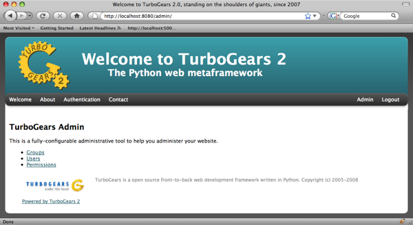
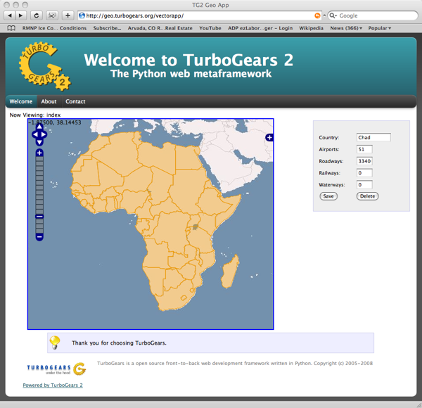

TG2 Extensions
==============
TG2 has some extensions which offer built-in functionality you can add to your application.
This is somewhat different from installing a WSGI application in your stack because the
extensions are intended to be more tightly integrated with the components that make
up a TurboGears application.

Admin
----------

The TurboGears Admin System is a great way to get started with your database.
Once your model is defined, this extension provides a set of pages to help you
create, view, delete, and edit your database objects.

.. toctree::
   :maxdepth: 2

   Admin/index
   
Crud
---------

Turbogears2 Crud Extension gives you a framework to develop a RESTful controller
method for your model class.  tgext.crud provides the building blocks for utilities
like tgext.admin and Catwalk.

.. toctree::
   :maxdepth: 2

   Crud/index

Geo
---------

TurboGears2 provides a set of extensions to help utilize your Geo Spatial Data.

.. toctree::
   :maxdepth: 2

   Geo/index
   

.. todo:: Review this file for todo items.

