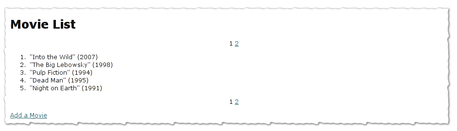
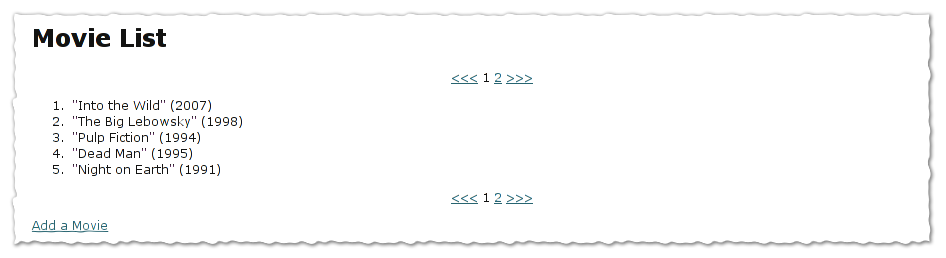
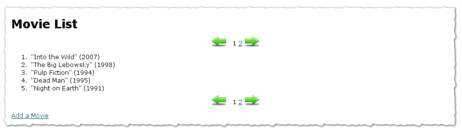

Pagination Quickstart For Turbogears2
=====================================

:Status: Work in progress

Prequisites
-----------

We start where the MovieDemo left off. See the `ToscaSample`_ tutorial
or download the zipped ToscaWidgetsFormsExample_.

.. _ToscaWidgetsFormsExample: ../../_static/ToscaWidgetsFormsExample.zip
.. _ToscaSample: http://www.turbogears.org/2.0/docs/main/ToscaWidgets/forms.html

Populating The Database
^^^^^^^^^^^^^^^^^^^^^^^

To have some sample data to work with, let's populate the database
with some movies. Add these lines to ``websetup.py`` (above
transaction.commit())::

	    movieDatas = [["Into the Wild", 2007],
	                  ["The Big Lebowsky", 1998],
	                  ["Pulp Fiction", 1994],
	                  ["Dead Man", 1995],
	                  ["Night on Earth", 1991],
	                  ["Genova", 2008],
	                  ["Snatch", 2000]]
	    
	    movies = []
	    for data in movieDatas:
	        movie = Movie()
	        movie.title = data[0]
	        movie.year = data[1]
	        model.DBSession.add(movie)
  

After you set up your app and restart the server you should now have
seven movies listed.

.. code-block:: bash

	paster setup-app development.ini
	paster serve --reload development.ini
	 
    

Basic Pagination
----------------

With a model and some data set up, add ``webhelpers.paginate`` to your
controller, and create an instance of ``paginate.Page`` that you pass
to the template.

Import paginate in your ``controllers/root.py`` and modify the
``list()`` method to look like this::

	    from webhelpers import paginate
		
	    @expose("toscasample.templates.movie_list")
	    def list(self, page=1):
	        """List and paginate all movies in the database"""
	        movies = DBSession.query(Movie)
	        currentPage = paginate.Page(movies, page, items_per_page=5)
	        return dict(movies=currentPage.items, page='ToscaSample Movie list', currentPage=currentPage)

This creates and passes a ``paginate.Page`` object to our template, so
we can use it there to access a ``pager()``.

The subset of items that should be displayed for the current page we
get from ``currentPage.items`` and display them in the template like
we normally would.

Now the pagination can be displayed in the template like this:

.. highlight:: html+genshi

Template code in ``templates/movie_list.html``::

	
${currentPage.pager()}

	
.. highlight:: python

Now we add some padding to the pagelist and make it centered.

Create a file pagination.css in your public/css/ directory with the
following contents and include it in style.css:
 
.. highlight:: css

CSS in ``public/css/style.css``::

	@import url("pagination.css"); 

CSS in ``public/css/pagination.css``::

	.pagelist strong {
		padding: 5px;
	}
	
	p.pagelist {
		text-align: center;
	}
	
Your movie listing should now look something like this:

		

Advanced Pagination
-------------------

More Formatting
^^^^^^^^^^^^^^^

Demonstrating some more formating arguments::

	${currentPage.pager(format='~3~', page_param='page', show_if_single_page=True)}

	
See
http://www.pylonshq.com/docs/en/0.9.7/thirdparty/webhelpers/paginate/
for more details.

Adding Previous And Next Links
^^^^^^^^^^^^^^^^^^^^^^^^^^^^^^

Let's add previous and next links:

.. highlight:: html+genshi

Modify the pagelist in ``templates/movie_list.html`` to look like
this::

	

		<a class="prevPage" href="/books?page=${currentPage.previous_page}">&lt;&lt;&lt;</a>
		${currentPage.pager(format='~3~', page_param='page', show_if_single_page=True)}
		<a class="nextPage" href="/books?page=${currentPage.next_page}">&gt;&gt;&gt;</a>
	

	
Functional, but not very pretty:

Adding Some Arrow Images
^^^^^^^^^^^^^^^^^^^^^^^^

Let's add some images:

 .. image:: icons/arrow-left.png
   :height: 32

 .. image:: icons/arrow-right.png
   :height: 32
   

.. note ::

	These images are public domain - feel free to use them any way
	you like.  Different sizes and the source \*.psd are included
	in the project file.)

.. highlight:: html+genshi

Change the pagelist code in ``templates/movie_list.html``::

	

		<a class="prevPage" href="/books?page=${currentPage.previous_page}">&nbsp;</a>
		${currentPage.pager(format='~3~', page_param='page', show_if_single_page=True)}
		<a class="nextPage" href="/books?page=${currentPage.next_page}">&nbsp;</a>
	

	
.. highlight:: css

Add this to the CSS in ``public/css/pagination.css``::

	a.prevPage {
		background: url("/images/icons/png/32x32/arrow-left.png") no-repeat;
		padding-left: 18px;
		padding-right: 18px;
		padding-top: 12px;
		padding-bottom: 15px;
		text-decoration: none;
		}
	
	.nextPage {
		background: url("/images/icons/png/32x32/arrow-right.png") no-repeat;
		padding-left: 18px;
		padding-right: 18px;
		padding-top: 12px;
		padding-bottom: 15px;
		text-decoration: none;
		}		

And this is what the end result looks like:

An :download:`Example Project <ToscaWidgetsFormsPaginated.zip>` has
been attached so that you can try this easily.

.. todo:: Difficulty: Easy to Medium. Does pagination still work this way for 2.1?
