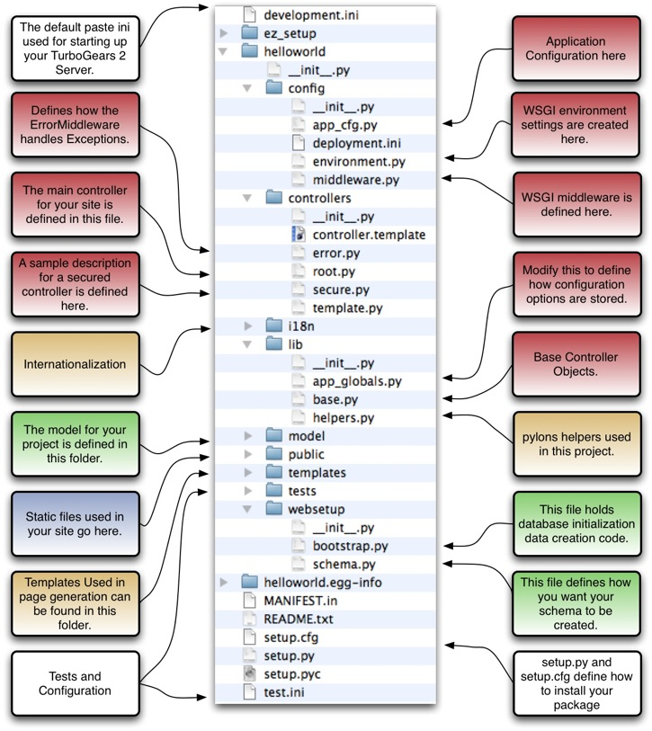

.. _quickstarting:

.. highlight:: bash

Quickstarting a TurboGears 2 project
====================================

:Status: Work in progress

.. contents:: Table of Contents
    :depth: 2

Now we assume you've got TurboGears installed and, if you installed it in a
virtual environment, that your virtualenv is activated.  TurboGears 2 extends
the ``paster`` command-line tool to provide a suite of tools for working with
TurboGears 2 projects. A few will be touched upon in this tutorial, check the
``paster --help`` command for a full listing.

The very first tool you'll need is ``paster quickstart``, which initializes a
TurboGears 2 project.  You can go to whatever directory you want and start a
new TurboGears 2 project by typing::

  $ paster quickstart

The ``paster quickstart`` command will create a basic project directory for you
to use to get started on your TurboGears 2 application. You'll be prompted for
the name of the project (this is the pretty name that human beings would
appreciate), and the name of the package (this is the less-pretty name that
Python will like).

Here's what our choices for this tutorial look like::

    Enter project name: Helloworld
    Enter package name [helloworld]: helloworld
    Do you need authentication and authorization in this project? [yes]
    ...output...

This will create a new directory which contains a few files in a directory
tree, with some code already set up for you.

Let's go in there and you can take a look around::

   $ cd Helloworld

The ``setup.py`` file has a section which explicitly declares the dependencies
of your application.   The quickstart template has a few built in dependencies,
and as you add new python libraries to your application's stack, you'll want to
add them here too. 

Then in order to make sure all those dependencies are installed you will want
to run:: 

   $ python setup.py develop

If you have just installed turbogears and are in a relatively new virtualenv,
expect to see a bit of output about additional packages being installed.

Create the database
-------------------

Most applications will use a database, and since we specified we are using 
"authentication" in our quickstart, we need a place to store users and 
permissions.    Before you run your application for the first time, you 
need to make sure the database is created and initialized.   The following
command typically only needs to be run *once*::

      $ paster setup-app development.ini

With the quickstart command from above, you will see quite a bit of output
which shows you the SQL commands that create the authentication tables and
setup a default user/password for you::

      user: manager
      password: managepass

You don't need to understand all of this now, but here is a little background
about how "paste setup-app" knows what to do.  By default, the database is
created using SQLite_, and the data is stored in a file, devdata.db, in the top
level of your project.  The information about what database driver is used is
specified in the development.ini file passed on the command line.   The code
which adds the initial data rows is in helloword/web_setup.py.  The command
"paster setup-app" ends up calling the function "setup_app" within this file.

.. note:: from laurin, decide whether the above section sufficiently covers the
   database creation process (at this time).   I think there is some really 
   good information below, but I'm not sure it belongs in a "helloworld"
   tutorial.   Especially the part using {yourproject}.   Ideally, I'd think
   we'd want a brief page on each default folder, and how an application
   starts...   I may be dreaming though...

Another key piece of TG2 application setup infrastructure is the ``paster
setup-app`` command which takes a configuration file and runs your project's
websetup code in that context.  This allows you to use setup-app to create
database tables, pre-populate require data into your database, and otherwise
make things nice for people fist setting up your app.  If you take a look at
your project's quickstart, you will see a websetup folder.  In here are two
files, bootstrap.py and schema.py.  One is for creating database schema, the
other for adding data to your database.

.. note :: 

  If it's the first time you're going to use the application, and you told
  quickstart to include authentication+authorizaiton, you will *have* to
  run ``setup-app`` to set it up (e.g., create a test database)::
  
      $ paster setup-app development.ini

This will create the database using the information stored in the
development.ini file which by default makes single file SQLite database in the
local file system.  In addition to creating the database, it runs whatever
extra database loaders or other setup are defined in
{yourproject}.websetup.schema.  

In a quickstarted project with Auth enabled setup-app creates a couple of basic
users, groups, and permissions for you to use as an example.  This code is
found in {yourproject}.websetup.bootstrap.  This code also shows how you can
add new data automatically to the database when the setup-app command is
executed.. 

Run the server
---------------

At this point your project should be operational, and you're ready to start up
the app.   To start a TurboGears 2 app, you need to be in the top level of your
project directory (`Helloworld`) and issue the command ``paster serve`` to
serve your new application::

    $ paster serve development.ini

As soon as that's done point your browser at http://localhost:8080/ and you'll
see a nice welcome page.

.. note::
    If you're exploring TurboGears 2 after using TurboGears 1 you may notice a few things:

      * The old config file `dev.cfg` file is now `development.ini`.
      * By default the ``paster serve`` command is not in auto-reload mode as
        the CherryPy server used to be.  If you also want your application to
        auto-reload whenever you change a source code file just add the
        ``--reload`` option to ``paster serve``::

          $ paster serve --reload development.ini

You might also notice that paster serve can be run from any directory as long
as you give it the path to the right ini file.

If you take a look at the code that quickstart created you'll see that there
isn't much involved in getting up and running.

In particular, you'll want to check out the files directly involved in
displaying this welcome page:

  * `development.ini` contains the system configuration for development.
  * `helloworld/controllers/root.py` contains the controller code to create the
    data for the welcome page along with usage examples for various tg2
    features.
  * `helloworld/templates/index.html` is the template turbogears uses to render
    the welcome page from the dictionary returned by the root controller. It's
    standard XHTML with some simple namespaced attributes.
  * `helloworld/public/` is the place to hold static files such as pictures,
    JavaScript, or CSS files.

You can easily edit development.ini to change the default server port used by
the built-in web server::

  [server:main]
  ...
  port = 8080
  
Just change 8080 to 80, and you'll be serving your app up on a standard port
(assuming your OS allows you to do this using your normal account).

Explore the rest of the quickstarted project code
----------------------------------------------------

Once you've got a quickstarted app going it's probably a good time to take a
look around the files that are generated by quickstart so you know where things
go. 

As you can see there are quite a few files generated. If you look inside them
you'll discover that many of them are just stubs so that you'll have a standard
place to put code as you build your project.

What was covered
----------------

All applications created with turbogears 2, will typically run 3 commands
to be properly setup:

.. code-block:: bash

   paster quickstart
   python setup.py develop
   paster setup-app development.ini

The last command, which creates and initializes the database, often happens
after the database is further defined.

In order to run the server in development mode, you typically use the 
following command::

   paster serve --reload development.ini

Next, we'll explore different ways of adding content to our page, including
`several approaches to the obligatory "Hello World" text <BasicMoves.html>`_.

.. _SQLite:  http://www.sqlite.org

.. todo:: Review this file for todo items.
.. todo:: laurin added and modified a few things.   please review my changes  
   most of it had to do with expected output from setup.py and setup-app
.. todo:: is there a better way to format manager/managepass, perhaps putting
   it on two separate lines?   Hmmm...  two separate lines now, but I had to remove the "note".
.. todo:: since we mention port, should we also mention changing host to 
   0.0.0.0 for serving to all network interfaces, not just localhost?   
   probably overkill here.    but maybe add somewhere else...
.. todo:: ideally, I'd like to see an expansion of the "explore a quickstarted 
   application".    I think knowing how an application is laid out, 
   gets initialized, starts up, and how some of the basic pieces fit together
   is really valuable information.   Obviously it goes beyond intro material.

