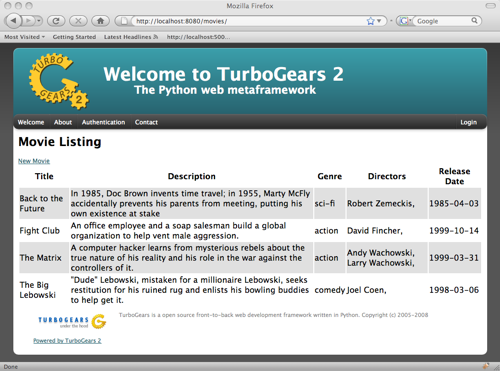
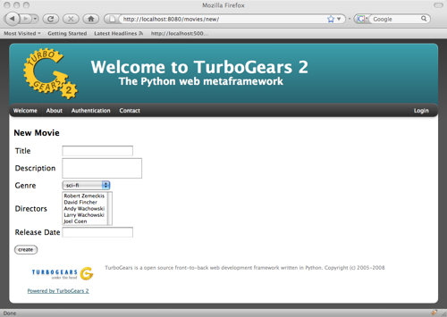
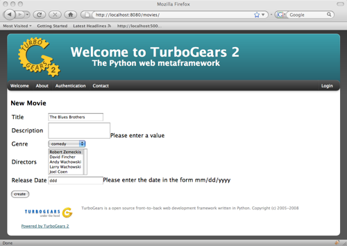
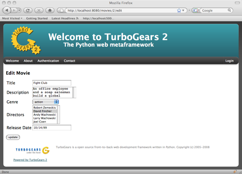
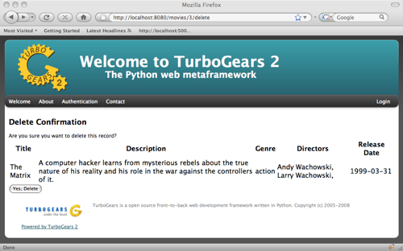

Developing RESTful Web Applications with TurboGears
========================================================

If you are developing an application where you want to expose your database using a stateless API,
:class:`tg.controllers.RestController` might be for you.  If you want to serve resources with multiple formats, and handle
embedded resource lookup, you might find RestController useful.  If you want to provide simple 
URLs which are consistent across all of the data shared and manipulated in your application, 
RestController is probably worth a look.

Unlike TGController, RestController provides a mechanism to access the request's method, not just the URL.  If you are not
familiar with how HTTP requests work, think for a minute about the difference between sending a form with GET and POST.
Primarily, developers use POST to send data to modify the database.  They use GET to retrieve data.  This are HTTP methods.

Standard HTTP verbage includes: GET, POST, PUT, and DELETE.  RestController supports these, and also adds a few shortcuts
for URL dispatch that makes displaying the data as forms and lists a little easier for the user.  The API docs describe
each of the supported controller functions in brief, so use that if you already understand REST and need a quick way to start
using it.  This document is intended to provide a step-by-step example of how to implement REST using RestController.

Working Example of RestController
-------------------------------------
We return to our faithful workhorse Movie Demo for this Tutorial.  
I will not be using ToscaWidgets or Sprox for this demonstration, just simple forms and validators, along with HTML templates.
Creating the templates and validators by had is tedious work, but provides the lowest level description 
of the problem, so that we cannot be distracted from the task at hand, understanding 
RESTful dispatch as it pertains to TurboGears. The displays will likely be primitive, but will
express the needs of the Tutorial.  Here is the Model used to develop this controller::
   
    from sqlalchemy import Column, Integer, String, Date, Text, ForeignKey, Table
    from sqlalchemy.orm import relation
    
    from moviedemo.model import DeclarativeBase, metadata
    
    movie_directors_table = Table('movie_directors', metadata,
                                  Column('movie_id', Integer, ForeignKey('movies.movie_id'), primary_key = True),
                                  Column('director_id', Integer, ForeignKey('directors.director_id'), primary_key = True))
    
    class Genre(DeclarativeBase):
        __tablename__ = "genres"
        genre_id = Column(Integer, primary_key=True)
        name = Column(String(100))
    
    class Movie(DeclarativeBase):
        __tablename__ = "movies"
        movie_id = Column(Integer, primary_key=True)
        title = Column(String(100), nullable=False)
        description = Column(Text, nullable=True)
        genre_id = Column(Integer, ForeignKey('genres.genre_id'))
        genre = relation('Genre', backref='movies')
        release_date = Column(Date, nullable=True)

    class Director(DeclarativeBase):
        __tablename__ = "directors"
        movie_id = Column(Integer, primary_key=True)
        title = Column(String(100), nullable=False)
        movies = relation(Movie, secondary_join=movie_directors_table, backref="directors")
        
I am isolating Movies, Genres, and Directors for the purpose of understanding How objects might relate to one another
in a RESTful context.  For purposes of this demonstration, Movies can only have one Genre, but may be related to one
or more Directors.  Directors may be related to one or more Movies.

A Listing of our Resource
~~~~~~~~~~~~~~~~~~~~~~~~~~~~~~~~~
Lets provide a simple listing of the movies in our database.

Our controller class is going to look like this::

    from tg.controllers import RestController

    class MovieController(RestController):
    
        @expose('moviedemo.templates.movies.rest.get_all')
        def get_all(self):
            movies = DBSession.query(Movie).all()
            return dict(movies=movies)
    
With a template that looks like this::

    <html xmlns="http://www.w3.org/1999/xhtml"
          xmlns:py="http://genshi.edgewall.org/"
          xmlns:xi="http://www.w3.org/2001/XInclude">
      <xi:include href="master.html" />
    <head/>
    <body>
      
 &nbsp; 

      

        

          <h1 style="margin-top:1px;">Movie Listing</h1>
          <a href='new/'>New Movie</a>
            <table>
              <tr>
              <th>Title</th>
              <th>Description</th>
              <th>Genre</th>
              <th>Directors</th>
              <th>Release Date</th>
              </tr>
              <tr py:for="i, movie in enumerate(movies)" class="${i%2 and 'even' or 'odd'}">
                <td>${movie.title}</td>
                <td>${movie.description}</td>
                <td>${movie.genre.name}</td>
                <td>
                <py:for each="director in movie.directors">
                ${director.name},
                </py:for>
                </td>
                <td>${movie.release_date}</td>
              </tr>
            </table>
        

      

    </body>
    </html>

Which produces an output like this:

Displaying a new form
~~~~~~~~~~~~~~~~~~~~~~~~~
Now let's show the user a form to add a new movie.::

    @expose('moviedemo.templates.rest.movies.new')
    def new(self, **kw):
        genres = DBSession.query(Genre).all()
        directors = DBSession.query(Director).all()
        
        return dict(values=kw, genres=genres, directors=directors)

And our new template (the meaty part anyway)::

  <form method="POST" action="./">
    <table>
    <tr><td>Title </td><td><input type="textfield" name="title"/></td></tr>
    <tr><td>Description</td><td> <textarea name="description"></textarea></td></tr>
    <tr><td>Genre</td>
        <td>
          <select name="genre_id">
              <option py:for="genre in genres" value="$genre.genre_id">$genre.name</option>
          </select>
        </td></tr>
    <tr><td>Directors</td>
        <td>
          <select multiple="true" name="directors">
            <option py:for="director in directors" value="$director.director_id">$director.name</option>
          </select>
        </td></tr>

    <tr><td>Release Date</td><td><input type="textfield" name="release_date"/></td></tr>
    </table> 
    <input type="submit" value="create"/>
  </form>

Which is a plain Jane form like this (sorry I had to obscure the code a bit using the table).

        
Saving our item from the form
~~~~~~~~~~~~~~~~~~~~~~~~~~~~~~~~~
We use the `post` method to define how we go about saving our movie to the database.::

    from datetime import datetime

    class MovieRestController(RestController):
    
        ...

        @expose()
        def post(self, title, description, directors=None, genre_id=None, release_date=None):
            if genre_id is not None:
                genre_id = int(genre_id)
            if directors is not None:
                if not isinstance(directors, list):
                    directors = [directors]
                directors = [DBSession.query(Director).get(director) for director in directors]
            if release_date is not None:
                release_date = datetime.strptime(release_date, "%m/%d/%y")
            movie = Movie(title=title, description=description, release_date=release_date, directors=directors, genre_id=genre_id)
            DBSession.add(movie)
            redirect('./')

If the form is successful, we will be redirected to the "get_all" page.  This will not be the case if the user enters some weird
date format for "release_date".  One way to counteract this problem is by writing a validator to redirect back to the new form
when the date doesn't match the expected format.
            
Validating the user's input
+++++++++++++++++++++++++++++
Before we add our record to the database, it is probably a good idea to validate
the data so we can prompt the user if there are mistakes.
RestController uses the same machinery that TGController's use for validation. We use FormEncode's validators to test
that our fields are not empty, and that the release_date has correct formatting::
    
    @validate({'title':NotEmpty, 
               'description':NotEmpty, 
               'genre_id':Int(not_empty=True), 
               'release_date':DateConverter(not_empty=True)}, error_handler=new)
    @expose()
    def post(self, **kw):
        ...

Now that we are returning to the new form some values from the failed validation, we need to
send the failed data back to the form so the user can correct it::

    @expose('moviedemo.templates.rest.movies.new')
    def new(self, *args, **kw):
        genres = DBSession.query(Genre).all()
        directors = DBSession.query(Director).all()
        
        if 'directors' in kw and not isinstance(kw['directors'], list):
            kw['directors'] = [kw['directors']]
    
        return dict(values=kw, genres=genres, directors=directors)

That "directors" bit is in there to convert the directors over to a list if only one is selected in the select box.
**kw holds the values from the rejected form, which we pass back into the template. Adding in the validation errors 
and rejected form values from our controller, our template looks like this::

  <form method="POST" action="./">
    <table>
    <tr><td>Title </td><td><input type="textfield" name="title" value="${values.get('title', '')}"/>${tmpl_context.form_errors.get('title')}</td></tr>
    <tr><td>Description</td><td> <textarea name="description">${values.get('description')}</textarea>${tmpl_context.form_errors.get('description')}</td></tr>
    <tr><td>Genre</td>
        <td>
          <select name="genre_id">
              <py:for each="genre in genres">
                <py:if test="values.get('genre_id') == unicode(genre.genre_id)">
                  <option value="$genre.genre_id" selected="selected">$genre.name</option>
                </py:if>
                <py:if test="values.get('genre_id')!= unicode(genre.genre_id)">
                  <option value="$genre.genre_id">$genre.name</option>
                </py:if>
              </py:for>
          </select>
        </td></tr>
    <tr><td>Directors</td>
        <td>
          <select multiple="true" name="directors">
              <py:for each="director in directors">
                $director.name
                <py:if test="unicode(director.director_id) in values.get('directors', [])">
                  <option value="$director.director_id" selected="selected">$director.name</option>
                </py:if>
                <py:if test="unicode(director.director_id) not in values.get('directors', [])">
                  <option value="$director.director_id">$director.name</option>
                </py:if>
              </py:for>
          </select>
        </td></tr>
    <tr><td>Release Date</td><td><input type="textfield" name="release_date" value="${values.get('release_date')}"/>${tmpl_context.form_errors.get('release_date')}</td></tr>
    </table> 
    <input type="submit" value="create"/>
  </form>

Note that the form_errors are stored in tmpl_context.  This is done by the TG dispatch on a failed validation.
If this code doesn't make you appreciate ToscaWidgets, I am not sure what will.  Here is what the form looks like
when it comes back from a failed validation:

Getting one item from our Resource
~~~~~~~~~~~~~~~~~~~~~~~~~~~~~~~~~~~~~
Using the get_one() method, we can display one item from the database to the user.::

    @expose('moviedemo.templates.rest.get_one')
    def get_one(self, movie_id):
        movie = DBSession.query(Movie).get(movie_id)
        return dict(movie=movie)
    
We might also return this item as a json stream.::

    @expose('json')
    @expose('moviedemo.templates.rest.get_one')
    def get_one(self, movie_id):
        movie = DBSession.query(Movie).get(movie_id)
        return dict(movie=movie)

Displaying an edit form
~~~~~~~~~~~~~~~~~~~~~~~~~
This is similar to what we did with the new() method, but now we need to provide existing
data about the user inputs to the form.::

    @expose('moviedemo.templates.rest.movies.edit')
    def edit(self, movie_id, *args, **kw):
        genres = DBSession.query(Genre).all()
        directors = DBSession.query(Director).all()
        movie = DBSession.query(Movie).get(movie_id)
        
        values = dict(title=movie.title, 
                      description=movie.description, 
                      genre_id=movie.genre_id,
                      directors = [str(director.director_id) for director in movie.directors],
                      release_date = datetime.strftime(movie.release_date, "%m/%d/%y"),
                      )
                      
        if 'directors' in kw and not isinstance(kw['directors'], list):
            kw['directors'] = [kw['directors']]
        values.update(kw)

        return dict(values=values, genres=genres, directors=directors)
        
Here is the form on display, showing /movies/2/edit.

Updating our record in the database (with validation)
~~~~~~~~~~~~~~~~~~~~~~~~~~~~~~~~~~~~~~~~~~~~~~~~~~~~~~~

PUT is the method used for updating an existing record using REST.  
We can validate in the same manner as before, but this time returning to the edit form on validation failure.::

    @validate({'title':NotEmpty, 
               'description':NotEmpty, 
               'genre_id':Int(not_empty=True), 
               'release_date':DateConverter(not_empty=True)}, error_handler=edit)
    @expose()
    def put(self, movie_id, title, description, directors, genre_id, release_date, **kw):
        movie = DBSession.query(Movie).get(movie_id)
        genre_id = int(genre_id)
        if not isinstance(directors, list):
            directors = [directors]
        directors = [DBSession.query(Director).get(director) for director in directors]
            
        movie.genre_id = genre_id
        movie.title=title
        movie.description = description
        movie.directors = directors
        movie.release_date = release_date

        DBSession.flush()
        redirect('../')
        
Displaying a delete confirmation
~~~~~~~~~~~~~~~~~~~~~~~~~~~~~~~~~
Rest controller provides a delete confirmation method, so you can double check that 
the user wants to delete a given resource.  Here is the method we would write to
allow the user to delete a single movie.::

    @expose('moviedemo.templates.rest.get_delete')
    def get_delete(self, movie_id):
        movie = DBSession.query(Movie).get(movie_id)
        return dict(movie=movie)

Here is a template to display some data to the user for deletion confirmation::

    <h2>Delete Confirmation</h2>
    Are you sure you want to delete this record?
    <table>
      <tr>
      <th>Title</th>
      <th>Description</th>
      <th>Genre</th>
      <th>Directors</th>
      <th>Release Date</th>
      </tr>
      <tr>
        <td>${movie.title}</td>
        <td>${movie.description}</td>
        <td>${movie.genre.name}</td>
        <td>
        <py:for each="director in movie.directors">
        ${director.name},
        </py:for>
        </td>
        <td>${movie.release_date}</td>
      </tr>
    </table>
    <form action='./' method="POST">
      <input type="hidden" name='_method' value='DELETE'/>
      <input type="submit" value="Yes, Delete"/>
    </form>

Here is what the confirmation looks like:

Deleting an item from our resource
~~~~~~~~~~~~~~~~~~~~~~~~~~~~~~~~~~~
The work-horse of delete is attached to the post_delete method.  Here we actually
remove the record from the database, and then redirect back to the listing page.::

    @expose()
    def post_delete(self, movie_id, **kw):
        DBSession.delete(DBSession.query(Movie).get(movie_id))
        redirect('../')

But the API docs say get() and delete() are also supported?
~~~~~~~~~~~~~~~~~~~~~~~~~~~~~~~~~~~~~~~~~~~~~~~~~~~~~~~~~~~~~~~~~~~~~~~~~~~~~

Yes, GET and DELETE methods are both supported.  This support is mainly provided for users
of RestController that want to create a RESTful interface using TG as a framework.  This is
ideal for programs that expect their server to be accessed programatically, rather than
through a web browser.  get() routes the same way get_all/get_one routes, delete is hit from
either POST or GET methods (which might be seen as dangerous if you are not careful.)

Non-RESTful methods?
-----------------------
Let's face it, REST is cool, but sometimes it doesn't meet our needs or time constraints.
A good example of this is a case where you want an autocomplete dropdown in your "edit" form,
but the resource that would provide the Json for this dropdown has not been fleshed out yet.
as a hack, you might add a field_dropdown() method in your controller which sends back the
json required to feed your form.  RestController allows methods named outside of the boundaries
of the default methods supported.   In other words, it's just fine to include a method in
your RestController that does not fit the REST HTML verbage specification.

Supporting TGController's inside RestController
---------------------------------------------------
Just as RestController supports obscure names for methods, it can handle nested TGController
classes as well.  When dispatch encounters a URL which maps to a non-RestController, it switches
back to the normal TG dispatch.  Simply said, you may include regular classes for dispatch
within your RestController definition.

Nesting Resources with RestControllers
---------------------------------------
RestControllers expect nesting as any TG controller would, but it uses a different method of
dispatch regular TG Controllers.  This is necessary when you need resources that are related 
to other resources.  This can be a matter of perspective, or a hard-link which defines filters
the results of the sub controller.  For our example, we will use a nested controller to display
all of the directors associated with a Movie. 

The challenge for design of your restful interface is determining how to associate parts of the
url to the resource definition, and defining which parts of the URL are part of the dispatch.  
To do this, RestController introspects the get_one method to determine how many bits of the
URL to nip off.  This is because you may have 1 or more identifiers to determine an object,
for instance you might use lat/lon to define a location.  Since our MovieController defines
a get_one which takes a movie_id as a parameter, we have no work to do there.  All we have to
do now is define our MovieDirectorController, and provide linkage into the MovieController
to provide this functionality::

    class MovieDirectorController(RestController):

        @expose('moviedemo.templates.rest.movie_directors.get_all')
        def get_all(self):
            movie = DBSession.query(Movie).get(movie_id)
            return dict(movie=movie, directors=movie.directors)
    
    class MovieRestController(RestController):
        
        directors = MovieDirectorController()
    
        @expose('json')
        def get_one(self, movie_id):
            movies = DBSession.query(Movie).get(movie_id)
            return dict(movie=movie)

    
And here is the finished product, a show of all directors for a movie:

.. image:: images/controllers/rest/movie_directors.png

This example only defines the get_all function, I leave the other RESTful verbage as an exercise
for you to do.  One trick that I will explain, is how to use __before__ to get the related
Movie object within all of your MovieDirectorController methods with a single define.  Here is
what the Controller looks like with __before__ added in::

    class MovieDirectorController(RestController):
    
        def __before__(self, *args, **kw):
            movie_id = request.url.split('/')[-3]
            pylons.c.movie = DBSession.query(Movie).get(movie_id)
    
        
        @with_trailing_slash
        @expose('moviedemo.templates.rest.movie_directors.get_all')
        def get_all(self):
            return dict(movie=pylons.c.movie, directors=pylons.c.movie.directors)

The CRC, CrudRestController
------------------------------
If you think this seems like a lot of work just to create some simple CRUD for your database,
well, I have to agree.  Luckily we have ToscaWidgets, FormEncode, and Sprox to help generate
the forms for our templates.  We also have  `CrudRestController <Extensions/Crud/index.html>`_
which provides all of the create, update, and delete functionality automatically for our model
in question.  It might be worth taking a look!

The Bigger Picture, sharing your Resources
-------------------------------------------
There is an effort underway to understand how websites could communicate directly with each other
using REST as a protocol for data transfer.  This means that in the future, TG sites may be 
able to share data with one another programatically.  You might think of this as meta-social networking,
and a TG site created utilizing RestControllers will be well-equipped to handle this in the future.

Running the Demo Code
-----------------------

The sample code for this documentation lives in a `repository <http://pythontutorials.googlecode.com/svn/tutorials/moviedemo/trunk/>`_.  You can always check it out to play with it by::

  svn co http://pythontutorials.googlecode.com/svn/tutorials/moviedemo/trunk/ moviedemo
  cd moviedemo
  python setup.py
  paster setup-app development.ini
  paster serve development.ini