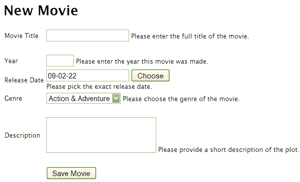
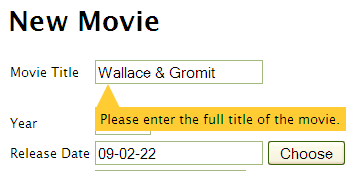
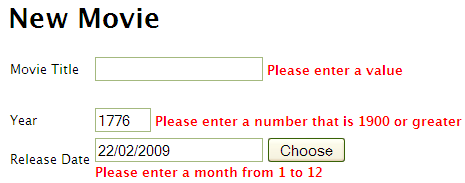

.. _tosca-forms:

Using ToscaWidgets to Create Forms
==================================

Introduction
------------

One of the most useful features of ToscaWidgets is the ability to create forms
with requisite validation with a simple declarative syntax.  Using existing
form widgets, it is relatively easy to add forms to your application to manage
your database interactions.

The overall process for creating a form is as follows:

* Create widgets for each field in the form.
* Create a form widget passing in the field widgets as children.
* If you are creating an edit form, extract the row data from the
  database.
* Call the widget in your template, passing in row data when
  appropriate.

.. archive:: tosca_forms
  :file: ToscaWidgetsFormsExample.zip

An :arch:`example project` has been attached so that you can try this
easily.

Tutorial
--------

For this tutorial, we will be implementing a form to add a movie to a
movie database. Let's create a new example project to try this out::

    $ paster quickstart -s -n ToscaSample

Confirm the package name ``toscasample``. We don't need authentication
and authorization for this sample project.

Let's start with a simple SQLAlchemy model that has only a Movie
object.  Add the following line at the bottom of
``model/__init__.py``::

    from movie import Movie

Now create a new Python module ``model/movie.py`` as follows:

.. highlight:: python
.. code:: tosca_forms/toscasample/model/movie.py

Our movie has a smattering of the different standard data types so
that we can show off some simple ToscaWidgets form widgets.

To setup your database you should run the following::

    $ paster setup-app development.ini

This will create the database schema in the database referenced in
your development.ini configuration file.

A very Basic Form
-----------------

We now want to create a simple input form widget for the model object.
In order to arrange our code more clearly, we create a new subpackage
``widgets`` in our project by adding a new subdirectory ``widgets``
with an empty ``__init__.py`` file in it.  The ``widgets`` subdirectory
should be on the same level as the ``controllers`` and ``model``
subdirectories.  Inside the ``widgets`` subdirectory, we create a
module ``movie_form.py`` containing the following very simple form
widget:

.. code:: tosca_forms/toscasample/widgets/movie_form_1.py

In ToscaWidgets, every widget can have child widgets. This is
particularly useful for forms, which are generally made up of form
field widgets.  A simple way of defining forms is the declarative
notation as used above.

Note that the standard ``Form`` widget does not have any associated
template, so we're using the ``TableForm`` widget that already
provides a template with a very simple table layout.

Displaying The Form
-------------------

We will now need a page template for displaying our form. Don't
confuse this page template (describing how our form is embedded in a
web page) with the form template (describing the layout of the form
fields inside the form).  For now we will use the default form
template that comes with ``TableForm``.  We will later also see how to
use our own form template.

Note that we're using Genshi templates here, but we could just as well
use another templating engine such as Mako.

For displaying our input form, we create a page template
``new_form.html`` in the main ``templates`` directory that will be
usable as input page for other model objects, too:

.. highlight:: html+genshi
.. code:: tosca_forms/toscasample/templates/new_form.html
.. highlight:: python

Finally, We will also need a controller for displaying our input form.
The controller module needs to import the instance of this form that
we have already created in ``widgets.movie_form``, and the template
context object that will allow us to pass the form from the controller
to the page template. So we add the following at the top of
``controllers/root.py``::

    from tg import tmpl_context
    from toscasample.widgets.movie_form import create_movie_form

Then we add an exposed method ``new()`` to the ``RootController``
class in the same controller file:

.. code:: tosca_forms/toscasample/controllers/root.py
  :section: new

To run the application, surf to `http://localhost:8080/new
<http://localhost:8080/new>`_ -- you will see a form that looks like
this:

.. image:: images/movie_form_1.png

Loading Options From The Database
---------------------------------

Suppose we do not want to use hardcoded ``genre_options``, but load
these options on the fly from the database. This is possible by
passing the options to the form widget at render time. To do this, you
would load the options in your controller method from an imaginary
``MovieGenera`` model class and pass them to the template like this::

    @expose('toscasample.templates.new_form')
    def new(self, **kw):
        """Form to add new movie data record."""
        tmpl_context.form = create_movie_form
        return dict(modelname='Movie',
            genre_options=model.DBSession.query(model.MovieGenera.id, model.MovieGenera.title),
            page='ToscaSample New Movie')

.. highlight:: html+genshi

Then in the page template you would display the form like this::

    
Input Form

Simple Customization
--------------------

Now, let's take a look at what we can do to customize the form to our
liking.

Each field has a set of attributes which we can change to suit our
needs.  For example, perhaps you are not satisfied with the text area
which is the default in ToscaWidgets forms.  You can change the
attributes of the text area simply by passing in a dictionary of
attributes to the ``attr`` parameter in the field definition.  Simple
text fields also provide a ``size`` attribute.

You may have noticed that our form already contained labels next to
the input fields.  These have been automatically generated from the
field names by capitalization and replacing underscores with blanks.
If this is not what you want, you can override these automatically
generated labels using the ``label_text`` attribute.

Another problem with this form is that if you are using SQLite, the
date is in the wrong format.  Let's give the CalendarDatePicker a
``date_format`` argument, and then our form will be viable.

In order to arrange the field elements more clearly, you can use the
``Label`` and ``Spacer`` widgets, or you can group fields that belong
together in a ``FieldSet`` container widget.

You can also change the text on the submit button with the
``submit_text`` parameter.

After such customization, our ``widget.movie_form`` module may now
look like this:

.. highlight:: python
.. code:: tosca_forms/toscasample/widgets/movie_form_2.py

The declarative notation we used earlier is a bit cumbersome in
combination with spacers or labels, so we provided the fields simply
as a list.

These changes result in the following new look of our form:

.. image:: images/movie_form_2.png

You will notice the different appearance and that that our date field
now has dashes in it instead of slashes.

Customizing With CSS And Form Templates
---------------------------------------

We will now add some CSS and a modified template to our form in order
to provide "tooltip-like" help texts for the individual form fields.

ToscaWidget forms already come with a ``help_text`` attribute. So
let's add some help texts in our ``widget.movie_form`` module and see
what will happen:

.. highlight:: python
.. code:: tosca_forms/toscasample/widgets/movie_form_3.py

The result is not very appealing.  Our help texts are simply inserted
as span elements after their corresponding field elements:

What we really want is that our help texts will only appear if the
user hovers with the mouse over the respective field.

One possible way to achieve this effect is to set the ``hover_help``
attribute of the form widget to true::

    class MovieForm(TableForm):

        hover_help = True

This will cause the help texts to be created as title attributes,
which will give the "tooltip-like" behavior in most modern browsers:

.. image:: images/movie_form_4.png

We want to go a step further and have our own kind of tooltips on a
colored background with a triangle acting as a pointer to the field.

.. highlight:: html+genshi

To realize this, the default span element for the help texts is not
enough; we need an additional span element for the pointer triangle.
This is the point where we need to customize the default ``TableForm``
template. So we create another ``templates`` package inside our
``widgets`` package and copy the default Genshi template
``table_form.html`` from ``tw.forms.templates`` into this new
``toscasample.widgets.templates`` package. The only change that we
make is to replace the following line::

    

with these lines that provide our additional span element::

    
        
        

We also create a CSS file ``tooltips.css`` that we put into the
``public/css`` directory of our project:

.. highlight:: css
.. code:: tosca_forms/toscasample/public/css/tooltips.css

We can now specify our custom template and CSS file in the
``template`` and ``css`` attributes of our form widget.  The
``widget.movie_form`` module will look as follows after this step:

.. highlight:: python
.. code:: tosca_forms/toscasample/widgets/movie_form_5.py

This was all that needed to be done to get the following nice effect
when you hover with the mouse over one of the input fields:

Adding a File Upload
----------------------

Now let's add a file upload to see how that works.  We will add a new
file field to our form, and then on the serverside we will gather
the data from the file form and save it to a file in the public directory
on the server.  This file could later be served up and displayed on our
movie page.

The first thing we need to do is add the file field to our form.  
First, add ``FileField`` to our import::

    from tw.forms import (TableForm, CalendarDatePicker,
        SingleSelectField, Spacer, TextField, TextArea, FileField)

Then, add the field to the ``fields`` parameter of our widget::

        FileField('picture_filename',
            help_text = 'Please provide a picture for this movie.'),
        Spacer()

Our form now looks like this:

.. image:: images/movie_form_7.png

Now, if you look at the source for your page you will see that the enctype
has changed in our form.::

   <form id="create_movie_form" action="create" method="post" class="required movieform" enctype="multipart/form-data">

If you happen to be looking at this reference for pointers on how to 
upload files, then this is important to note if you are not using
ToscaWidgets.  ``enctype="multipart/form-data"`` is needed in order
to tell the web server that the form contains a multipart message,
including a file to upload.

Now we can modify our create method to save our new file to the public directory,
noting the filename in the database.  First, we need to locate our public directory:

.. code:: tosca_forms/toscasample/controllers/root.py
  :section: picture_import

Then we change the create code to save our filename to the database and our file to
the public directory.

.. code:: tosca_forms/toscasample/controllers/root.py
  :section: create_with_picture

Now if you check the public directory after an insert you will see
the file has been written.  This file could be used in the listing
or display of the movie information, since it has been placed
in the public directory.

More Form Fields
----------------

ToscaWidgets_ contains some more form useful form fields. These can be
classified into basic fields, selection fields and buttons. Fieldsets
and forms themselves are actually realized as form fields that can
contain a list of other form fields.

The ToscaWidgets_ documentation has a list of all `available form
fields`_.

.. _ToscaWidgets: http://toscawidgets.org
.. _`available form fields`: http://toscawidgets.org/documentation/tw.forms/modules/fields/

Form Validation
---------------

Form validation is a very powerful way to make sure that the data
entered by users is formatted in a predictable manner long before
database interaction happens.  When data entered into a form does not
match that which is required, the user should be redirected back to
the form to re-enter their data.  A message indicating the problem
should be displayed for all fields which are in error at the same
time.  ToscaWidgets takes advantage of the work done in FormEncode_ to
do its validation.

The first thing we need to do is add a validator to each of the fields
that we would like to have validated.  Each form field takes a
validator argument.  The form itself is then passed into a method
decorator which checks to see whether the data coming in from the
client validates against the validator defined in the widget.  Our new
``widget.movie_form`` module with validation looks something like
this:

.. highlight:: python
.. code:: tosca_forms/toscasample/widgets/movie_form_6.py

Note that we removed the date format from the CalendarDatePicker
again.  This is because the DateConverter will take whatever date is
entered in the box and convert it to a datetime object, which is much
better understood by SQLAlchemy than a date string.

Also note that we did not import the validators from
``formencode.validators`` directly, but we imported them from
``tw.forms.validators`` instead. You should always do this if you work
with ``tw.forms``, since it makes sure that you will get versions of
the FormEncode validators that play well with the ``tw.forms`` module
(the validators used in our example are the same, though).

Our controller now gets a new validator decorator for the creation of
the movie entry.  But first we need to import a couple of things at
the beginning of our ``controllers/root.py`` file::

    from tg import tmpl_context, redirect, validate
    from toscasample.model import metadata, DBSession, Movie
    from toscasample.widgets.movie_form import create_movie_form

Then we can add an exposed ``create()`` method to the
``RootController`` class in the same controller file, directly after
the ``new()`` method:

.. code:: tosca_forms/toscasample/controllers/root.py
  :section: create

Note that we have created the ``create_movie_form`` instance with
``action='create'`` so that this controller method will be called when
the submit button at the button of the form is pressed.

The resulting form on a bad entry will give you a output like this:

In short, there are many things you can do with validators, but the
above example gives you a basic understanding of how validators can be
used to check user input.

When the form validation passes, the ``create()`` method redirects to
an exposed ``list()`` method for displaying the list of movies, but we
haven't created that method yet.  It can look like this:

.. code:: tosca_forms/toscasample/controllers/root.py
  :section: list

To show the movie list, we also need to add a template named
``movie_list.html`` in our main templates directory, which can contain
as little as this:

.. highlight:: html+genshi
.. code:: tosca_forms/toscasample/templates/movie_list.html
.. highlight:: python

As an exercise, you can try to make the movies in the list editable by
adding an ``update()`` controller method. This method must read the
corresponding data record and pass it to a template similar to
``new_form.html``, except that you must call the form widget with the
data that has been passed by the controller. You can also let the
``new()`` method return None as data and use the same page template
for both controllers.

More Validators
---------------

The FormEncode_ documentation has a list of all `available
validators`_.

But remember to import these validators indirectly through
``tw.forms.validators`` if you're using them to validate ToscaWidget
form fields, because some of them (most notably ``UnicodeString``)
have adapted versions which interoperate better with ToscaWidgets
forms.  The ``tw.forms.validators`` module also provides some
`additional validators`_ that you may find useful.

You can also build `compound validators`_ (schemas) corresponding to
fieldsets or whole forms.

.. _FormEncode: http://www.formencode.org
.. _`available validators`: http://formencode.org/module-formencode.validators.html
.. _`compound validators`: http://www.formencode.org/Validator.html#compound-validators
.. _`additional validators`: http://toscawidgets.org/documentation/tw.forms/modules/validators.html
