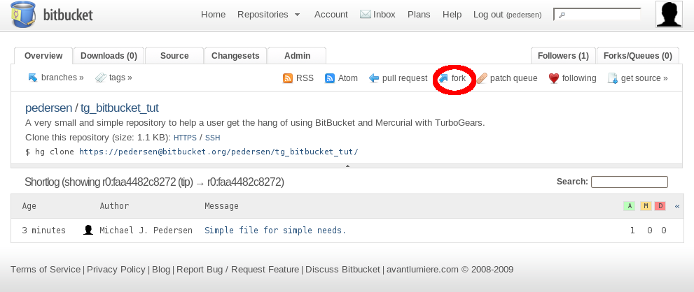
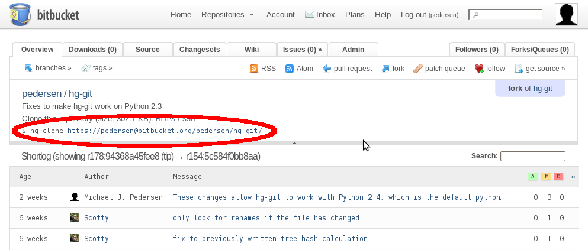
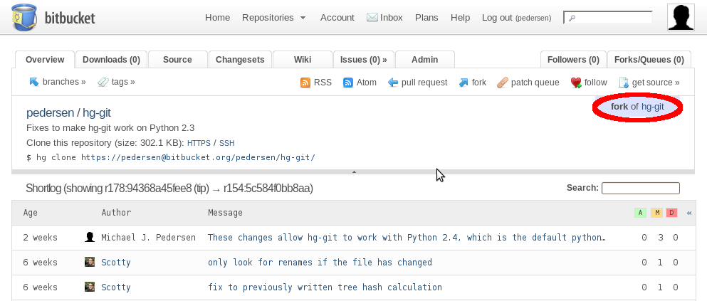
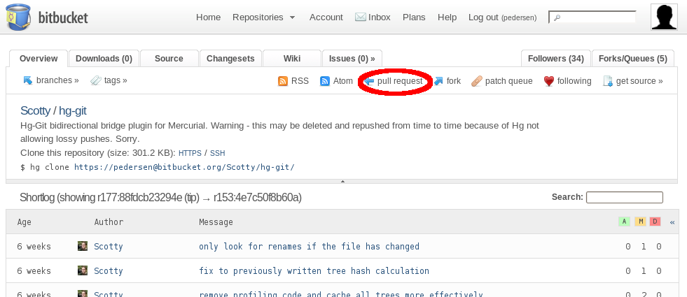
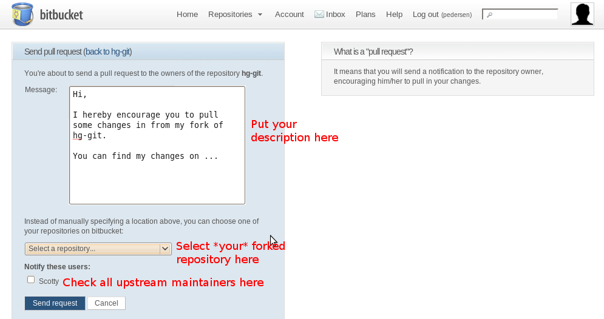

.. _bitbucket_tutorial:

Using BitBucket's Mercurial Service with TurboGears
===================================================

BitBucket_ is a service used heavily by the TurboGears team. It stores the
current copy of the TurboGears code that is in development, and makes it
easier for the developers to collaborate on changes. It allows for very
large changes to be done safely, in a sandbox, without affecting the main
development tree.

It does all this by using a new type of version control system called a
distributed version control system. In BitBucket_'s case, this distributed
version control system is named Mercurial_. `An entire book`_ has been
written on using Mercurial_. The Mercurial_ website has many examples to
show what you can do.

For our needs, though, the actual bits that you need to know for BitBucket_
and Mercurial_ are small and easy. By the end of this tutorial, you should
be able to do the following items easily:

1. Fork a project on BitBucket_

2. Make your local clone of your project

3. Make changes to your local clone.

4. Commit your changes.

5. Push your changes back to BitBucket_

6. Notify the upstream maintainer of your changes, to get them included

All of that sounds like a lot, but you'd be surprised how easy it really
is.

Signup For Free Account
-----------------------
First, sign up for one of the free accounts on BitBucket_. Since this could
change in future, I'm not including links or descriptions. If they ever
make it genuinely difficult, we'll revisit this section.

Fork A Project
--------------
So, now you need to fork a project. You can always fork one of the
`TurboGears projects`_, but that is a bit of overkill when learning how to
use BitBucket_. Instead, we've made a small repository especially for this
purpose.

Open https://bitbucket.org/pedersen/tg_bitbucket_tut/ in your browser. You
should get a screen that looks like this:

Click the "Fork Link", and give your new copy a name, description, and
finally hit submit. A few moments later, you will have a forked copy of the
project with which you can work.

Make Your Local Clone
---------------------

Now that you have your fork, you need to copy it to your machine.
Fortunately, BitBucket_ even tells you the command to use to download it.
Just follow the onscreen command, and do so.

Make Changes To Your Local Clone
--------------------------------

Using your favorite editor, we're going to make a few changes. First, view
the file README. A very simple file, right? Well, the name isn't so great.
Let's rename it to have a useful extension:

.. code-block:: bash

   hg mv README README.txt

That will rename the file to a nicer name.

Note that we have a file named "deleteme.txt". Let's see how to delete the
file next:

.. code-block:: bash

   hg rm deleteme.txt

The file is now removed. We can always go back in time and retrieve the
file (that is, after all, the point of any version control system), but it
won't be present in future unless we take steps to make it present.

Use your favorite text editor, and change the contents of the README.txt
file. Add in the following at the bottom of the file:

.. code-block:: bash

   Mercurial is neat. Nice and simple, but gets the job done very well.

Finally, we need to add a file. Make a new file in the directory named
"added_stuff.txt", and put the following into the file:

.. code-block:: bash

   Just some random text to stuff in a file, so we can add a file into the
   Mercurial tree.

Now, with all of those file operations done, how do we store our work into
the repository? See the next section.

Commit Your Changes
-------------------

Saving your changes to your local repository is accomplished via a simple
command.

.. code-block:: bash

   hg commit

This will bring up an editor. Type up a commit message, describing the
changes, and why you made them. You'll like having them around later, when
you start looking at the Mercurial_ logs.

That's all of it. That's the basic day to day operations of storing all
your changes in your local copy. However, that does not cover sharing those
changes with the world. All your changes are still on your machine.

Push Your Changes To BitBucket_
-------------------------------

Now it's time to publish your changes. You've been working on them for a
while, have been making commits to make sure you could always roll back to
an earlier time, and your work is finally ready to take on the world.
Sending those changes up to BitBucket_ is very easy. You run this command:

.. code-block:: bash

   hg push

Your changes will now be visible in your repository on BitBucket_. You can
tell other people to fork your repository, and in general share your work.
Frequently, though, you want to do more. If you've forked someone else's
project, you want your changes included in their project. The next section
talks about doing just that.

Notify The Upstream Maintainer
------------------------------

We're back into the browser now. Visit BitBucket_, and go to your project's
repository page. You will see something that looks like this:

Click the "fork of" link to take you back to the original project. Once on
the original project, click on "Pull Request" (see below).

Fill in the note describing your changes, check off the names of the
project maintainers you wish to be notified, and change the repository to
be your repository that you want the upstream maintainer to read from.

Click the "Send Request" button, and the upstream maintainer will be
notified via email that you have sent in a pull request, and given your
description of why they should pull from you.

When they accept it, your changes will become part of the official
repository on BitBucket_.

That's it in a nutshell. Mercurial_ offers much more than what is shown
here, but this is enough to get you started. I definitely recommend you
read the `Mercurial book`_, as it will show you how to customize
Mercurial_'s configuration to be exactly what you want it to be.

.. _BitBucket: http://www.bitbucket.org/

.. _Mercurial: http://mercurial.selenic.com/wiki/

.. _`An entire book`: http://hgbook.red-bean.com/

.. _`Mercurial book`: http://hgbook.red-bean.com/

.. _`TurboGears projects`: http://bitbucket.org/mramm/
