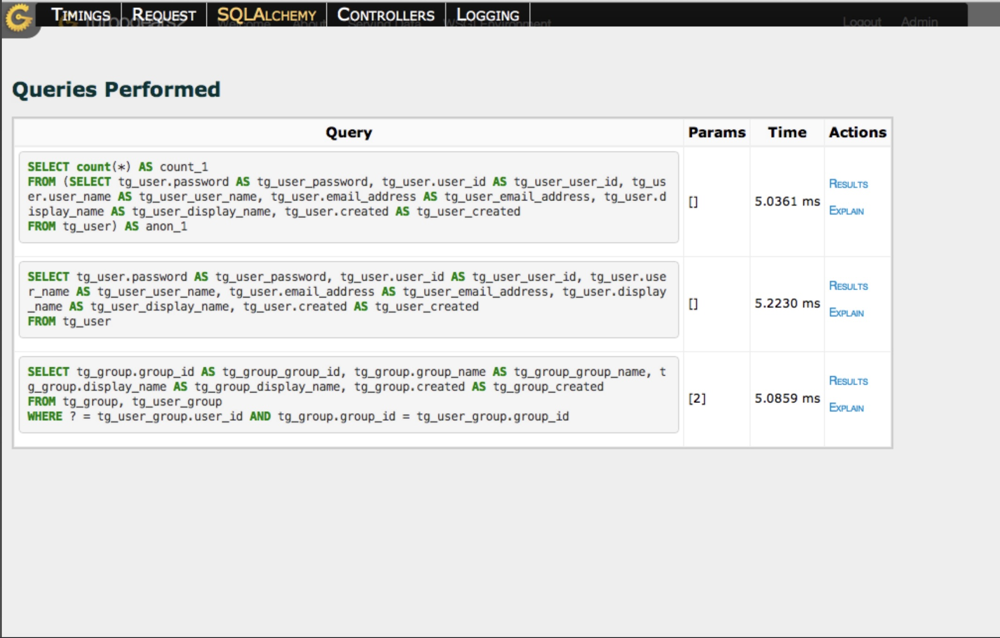
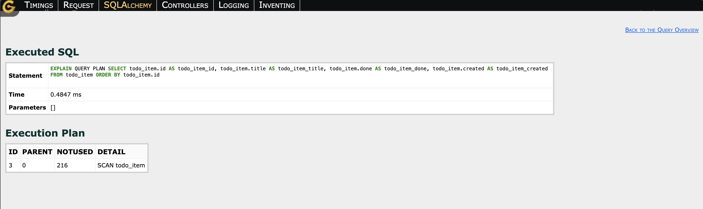
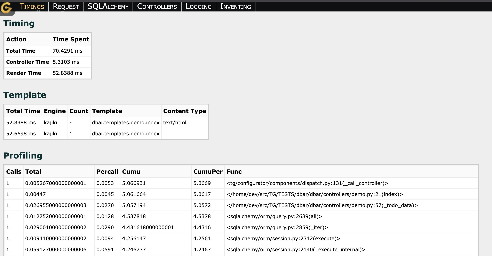

.. _profiling:

Profiling Web Applications
==========================

Profiling is an essential tool for identifying performance bottlenecks in your
TurboGears application. The ``tgext.debugbar`` extension provides profiling
capabilities when it is installed and enabled.

Enabling the Debugbar
---------------------

Quickstarted projects include ``tg.devtools`` in their development extra; it
installs ``tgext.debugbar``. Install that extra to enable the generated debugbar
configuration::

    $ pip install -e ".[development]"

The generated configuration enables the installed debugbar when ``debug = true``.
For a project without ``tg.devtools``, install ``tgext.debugbar`` and add this to
``config/app_cfg.py``::

    $ pip install tgext.debugbar

.. code-block:: python

    from tgext.debugbar import enable_debugbar
    enable_debugbar(base_config)

The debugbar is injected only into non-AJAX ``text/html`` responses that contain
both ``</head>`` and ``</body>`` markup.

The Debugbar Interface
----------------------

Once enabled, the debugbar provides several tabs with profiling information:

SQL Queries
~~~~~~~~~~~

The SQL tab shows database queries executed during the request, including:

- The SQL statement
- Parameters used
- Duration

This helps identify slow queries or N+1 query problems.

For ``SELECT`` statements, **Results** displays the returned rows and column
names. You can also view the execution plan by clicking **Explain**, which helps
optimize complex queries.

Request Profiling
~~~~~~~~~~~~~~~~

The profiling tab provides detailed timing information for the request:

- Total time
- Controller time
- Render time
- A Template table with grouped template entries, including total render time and invocation count
- cProfile function statistics

This allows you to quickly identify which parts of your application are taking the
most time to execute.

Using Profiling for Performance Optimization
-------------------------------------------

To optimize your application performance using the debugbar:

1. **Identify slow requests**: Look for requests with high total execution times
2. **Check SQL queries**: Look for queries taking more than 100ms or queries executed
   multiple times for similar data (N+1 problem)
3. **Analyze function statistics**: Identify expensive controller or template
   work
4. **Review execution plans**: For slow SQL queries, check if they're using proper
   indexes or if the query plan is suboptimal

Common Performance Issues Found with Profiling
----------------------------------------------

**N+1 Query Problem**
  The debugbar SQL tab will show many similar queries being executed in a loop.
  Solution: Use SQLAlchemy's ``joinedload`` or ``subqueryload`` to eager load
  relationships.

**Slow Template Rendering**
  If template rendering is taking significant time, check for complex logic in
  templates or large data sets being iterated.
  Solution: Move complex logic to controllers or use caching.

**Missing Indexes**
  The execution plan view can reveal full table scans on large tables.
  Solution: Add appropriate indexes to your database tables.

**Expensive Controller Logic**
  The profiling function statistics show where controller time is spent.
  Solution: Optimize the algorithm, add caching, or move to background tasks.

Production Considerations
-------------------------

The debugbar is designed for development use only and should not be enabled in
production environments as it:

- Adds overhead to every request
- Exposes sensitive information about your application
- Can impact performance significantly

For production profiling, consider:

- Using dedicated profiling tools like cProfile
- Enabling profiling temporarily on staging environments
- Using monitoring tools like New Relic or Datadog
- Reviewing application logs for slow requests

Best Practices
-------------

1. **Profile early and often**: Check the debugbar regularly during development
2. **Test with realistic data**: N+1 problems often only appear with larger datasets
3. **Profile the critical path**: Focus on the most frequently used pages and the
   most important user flows
4. **Set performance budgets**: Decide on acceptable response times and investigate
   anything exceeding them
5. **Profile after changes**: Always check performance after adding new features or
   making significant changes
